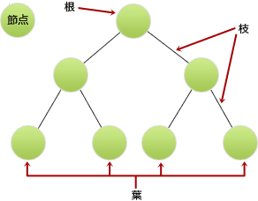

# [平成30年秋期 午前 問6](https://www.ap-siken.com/kakomon/30_aki/q6.html)

#問題 #テクノロジ #アルゴリズムとプログラミング #データ構造

解説を表示解説を隠す

<strong>問6</strong>　葉以外の節点はすべて二つの子をもち，根から葉までの深さがすべて等しい木を考える。この木に関する記述のうち，適切なものはどれか。ここで，木の深さとは根から葉に至るまでの枝の個数を表す。また，節点には根及び葉も含まれる。

<ul class="ap-choices">
<li class="ap-choice-item ap-wrong">

ア　枝の個数がnならば，葉を含む節点の個数もnである。

枝の個数は「6」，葉を含む節点の個数は「7」で一致しないので誤り。

</li>
<li class="ap-choice-item ap-wrong">

イ　木の深さがnならば，葉の個数は2n-1である。

深さ「2」のとき葉は「4」だが、22-1＝21＝2となり一致しないので誤り。

</li>
<li class="ap-choice-item ap-wrong">

ウ　節点の個数がnならば，深さはlog2nである。

節点「7」のとき深さは「2」だが、log27＝2.807…で一致しない。深さは log2(n＋1)－1。

</li>
<li class="ap-choice-item ap-correct">

エ　葉の個数がnならば，葉以外の節点の個数はn－1である。

正しい。葉「4」なら葉以外は「3」で、葉の個数をnとすると葉以外はn－1。

</li>
</ul>

<h4>解説</h4>

問題文にある「葉以外の節点はすべて二つの子をもち，根から葉までの深さがすべて等しい木」は次のような構造をもつ木です。

この<a href="用語/木構造" class="internal-link" data-href="用語/木構造">木構造</a>をもとに、すべての選択肢を検証してみます。

<ul>
<li>ア：枝の個数は「6」，葉を含む節点の個数は「7」で一致しないので誤りです。</li>
<li>イ：木の深さは「2」，葉の個数は「4」です。2n-1のnに木の深さ「2」を代入すると、 　22-1＝21＝2 となり葉の個数「4」と一致しないので誤りです。</li>
<li>ウ：葉を含む節点の個数は「7」で、木の深さは「2」です。log2nのnに節点の個数「7」を代入すると、 　log27＝2.807… 木の深さ「2」と一致しないので誤りです。  <a href="用語/完全2分木" class="internal-link" data-href="用語/完全2分木">完全2分木</a>では深さが1つ増える毎に節点の個数は次のように増加していきます。  (根のみ) 1 (深さ1) 1＋2＝3 (深さ2) 1＋2＋4＝7 (深さ3) 1＋2＋4＋8＝15 (深さ4) 1＋2＋4＋8＋16＝31 (深さ5) 1＋2＋4＋8＋16＋32＝63  このため節点の個数がnである<a href="用語/完全2分木" class="internal-link" data-href="用語/完全2分木">完全2分木</a>の深さは「log2(n＋1)－1」の式で表すことができます。</li>
<li>エ：葉の数は「4」，葉以外の節点には根が含まれるので「3」です。 葉の数をnとすると、葉以外の節点の数はn－1になっています。したがってこの記述が適切です。</li>
</ul>

「葉以外の節点はすべて二つの子をもち，根から葉までの深さがすべて等しい木」は<a href="用語/完全2分木" class="internal-link" data-href="用語/完全2分木">完全2分木</a>と呼ばれ、木の深さが「n」であれば葉の数は「2n」、葉の数が「n」であれば、葉以外の節点の数(根を含む)は「n－1」であるという特徴を持っています。

