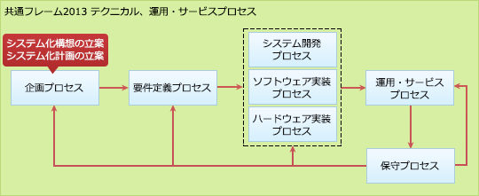

# [平成30年秋期 午前 問65](https://www.ap-siken.com/kakomon/30_aki/q65.html)

#問題 #ストラテジ #システム企画 #システム化計画

解説を表示解説を隠す

<strong>問65</strong>　ある企業が，AIなどの情報技術を利用した自動応答システムを導入して，コールセンターにおける顧客対応を無人化しようとしている。この企業が，システム化構想の立案プロセスで行うべきことはどれか。

<ul class="ap-choices">
<li class="ap-choice-item ap-correct">

ア　AIなどの情報技術の動向を調査し，顧客対応における省力化と品質向上など，競争優位を生み出すための情報技術の利用方法について分析する。

正しい。システム化構想の立案プロセスの作業です。

</li>
<li class="ap-choice-item ap-wrong">

イ　AIなどを利用した自動応答システムを構築する上でのソフトウェア製品又はシステムの信頼性，効率性など品質に関する要件を定義する。

要件定義プロセスの作業です。

</li>
<li class="ap-choice-item ap-wrong">

ウ　自動応答に必要なシステム機能及び能力などのシステム要件を定義し，システム要件を，AIなどを利用した製品又はサービスなどのシステム要素に割り当てる。

システム方式設計での作業です。

</li>
<li class="ap-choice-item ap-wrong">

エ　自動応答を実現するソフトウェア製品又はシステムの要件定義を行い，AIなどを利用した実現方式やインタフェース設計を行う。

<a href="用語/システム要件" class="internal-link" data-href="用語/システム要件">システム要件</a>定義や<a href="用語/ソフトウェア要件" class="internal-link" data-href="用語/ソフトウェア要件">ソフトウェア要件</a>定義の作業です。

</li>
</ul>

<h4>解説</h4>

共通フレーム2013では、<a href="用語/テクニカルプロセス" class="internal-link" data-href="用語/テクニカルプロセス">テクニカルプロセス</a>として、企画、要件定義、システム開発、ソフトウェア実装、ハードウェア実装、保守の各プロセスが規定されています。

「システム化構想の立案」は、企画プロセスを構成するプロセスの1つで、経営上のニーズ、課題を実現、解決するために、置かれた経営環境を踏まえて、新たな業務の全体像とそれを実現するためのシステム化構想及び推進体制を得ることを目的とするプロセスです。

システム化構想の立案プロセスには以下の7つのタスクが含まれており、情報技術に関する動向の調査や分析は、このプロセスで行うことになっています。

<ol>
<li>経営上のニーズ、課題の確認</li>
<li><a href="用語/事業環境" class="internal-link" data-href="用語/事業環境">事業環境</a>、<a href="用語/業務環境" class="internal-link" data-href="用語/業務環境">業務環境</a>の調査分析</li>
<li>現行業務、システムの調査分析</li>
<li><a href="用語/情報技術動向" class="internal-link" data-href="用語/情報技術動向">情報技術動向</a>の調査分析</li>
<li>対象となる業務の明確化</li>
<li>業務の新全体像の作成</li>
<li>対象の選定と投資目標の策定</li>
</ol>

したがって「ア」が正解です。

