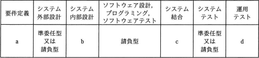
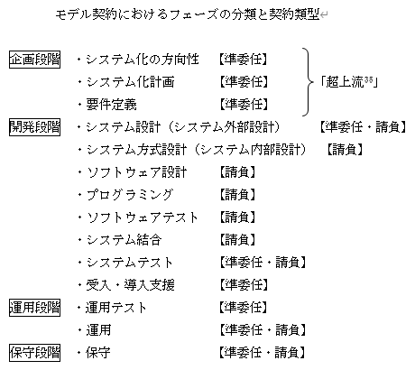

# [平成30年秋期 午前 問66](https://www.ap-siken.com/kakomon/30_aki/q66.html)

#問題 #ストラテジ #システム企画 #調達計画・実施

解説を表示解説を隠す

<strong>問66</strong>　ベンダーX社に対して，表に示すように要件定義フェーズから運用テストフェーズまでを委託したい。X社との契約に当たって，"情報システム・モデル取引・契約書＜第一版＞"に照らし，各フェーズの契約形態を整理した。a～dの契約形態のうち，準委任型が適切であるとされるものはどれか。 

<ul class="ap-choices">
<li class="ap-choice-item ap-wrong">

ア　a，b

b（システム内部設計）は請負型が適切とされ、準委任型の組合せではない。

</li>
<li class="ap-choice-item ap-correct">

イ　a，d

正しい。要件定義と運用テストは準委任型が適切とされる。

</li>
<li class="ap-choice-item ap-wrong">

ウ　b，c

b・c（システム内部設計・システム結合）はいずれも請負型が適切とされる。

</li>
<li class="ap-choice-item ap-wrong">

エ　b，d

b（システム内部設計）は請負型が適切とされ、準委任型の組合せではない。

</li>
</ul>

<h4>解説</h4>

<a href="用語/情報システム・モデル取引・契約書" class="internal-link" data-href="用語/情報システム・モデル取引・契約書">情報システム・モデル取引・契約書</a>は、ユーザーとベンダーのあるべき理想的なモデルを提示し、情報システムのライフサイクルプロセスの中で、『ユーザーとベンダーの間でどのようなことを決定し、どのようなことを情報共有すればよいか』についての統一的な指針を目指して策定されたガイドラインです。

<a href="用語/準委任契約" class="internal-link" data-href="用語/準委任契約">準委任契約</a>は、仕事の完成を目的とする<a href="用語/請負契約" class="internal-link" data-href="用語/請負契約">請負契約</a>と異なり、委託された仕事の実施自体を目的とする契約形態です。受託者は善良な管理者の注意をもって委任事務を処理する義務（善管注意義務）を負うものの、主に業務分析や要件定義、運用テスト工程などの成果物が特定されていない状況で結ばれます。

<a href="用語/情報システム・モデル取引・契約書" class="internal-link" data-href="用語/情報システム・モデル取引・契約書">情報システム・モデル取引・契約書</a>では、フェーズの分類と対応する契約類型を以下のように規定しています。

要件定義と運用テストは「準委任型」の契約、システム内部設計とシステム結合は「請負型」の契約が適切とされています。したがって「a，d」の組合せが適切です。

参考URL: <a href="用語/情報システム・モデル取引・契約書" class="internal-link" data-href="用語/情報システム・モデル取引・契約書">情報システム・モデル取引・契約書</a>＜第二版＞ https://www.ipa.go.jp/files/000087884.docx

