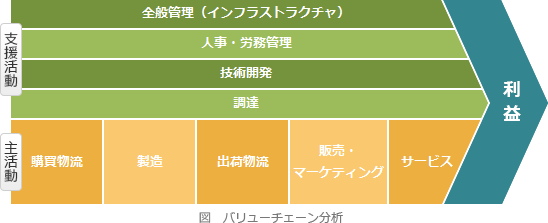
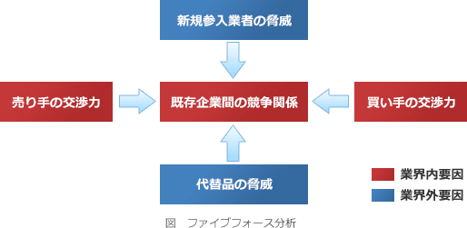
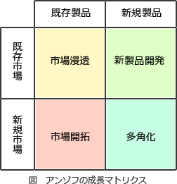
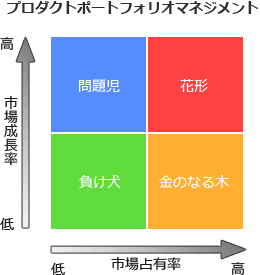

# [平成30年秋期 午前 問68](https://www.ap-siken.com/kakomon/30_aki/q68.html)

#問題 #ストラテジ #経営戦略マネジメント #経営戦略手法

解説を表示解説を隠す

<strong>問68</strong>　バリューチェーンによる分類はどれか。

<ul class="ap-choices">
<li class="ap-choice-item ap-wrong">

ア　競争要因を，新規参入の脅威，サプライヤの交渉力，買い手の交渉力，代替商品の脅威，競合企業の五つのカテゴリに分類する。

これは<a href="用語/ファイブフォース分析" class="internal-link" data-href="用語/ファイブフォース分析">ファイブフォース分析</a>の説明です。

</li>
<li class="ap-choice-item ap-correct">

イ　業務を，購買物流，製造，出荷物流，販売・マーケティング，サービスという五つの主活動と，人事・労務管理などの四つの支援活動に分類する。

正しい。バリューチェーンの説明です。

</li>
<li class="ap-choice-item ap-wrong">

ウ　事業の成長戦略を，製品(既存・新規)と市場(既存・新規)の2軸を用いて，市場浸透，市場開発，製品開発，多角化の4象限のマトリックスに分類する。

これはアンゾフの成長マトリクスの説明です。

</li>
<li class="ap-choice-item ap-wrong">

エ　製品を，市場の魅力度と自社の強みの2軸を用いて，花形，金のなる木，問題児，負け犬の4象限のマトリックスに分類する。

これはプロダクトポートフォリオマネジメントの説明です。

</li>
</ul>

<h4>解説</h4>

バリューチェーンとは、マイケル・ポーターの<a href="用語/競争戦略" class="internal-link" data-href="用語/競争戦略">競争戦略</a>の中で提唱された<a href="用語/フレームワーク" class="internal-link" data-href="用語/フレームワーク">フレームワーク</a>で、事業活動を価値創造活動の集合と捉え、製品の<a href="用語/付加価値" class="internal-link" data-href="用語/付加価値">付加価値</a>がどの部分（機能）で生み出されているかを分析し、その価値の連鎖を最適化するための<a href="用語/フレームワーク" class="internal-link" data-href="用語/フレームワーク">フレームワーク</a>です。業務を「購買物流」「製造」「出荷物流」「販売・マーケティング」「サービス」という5つの主活動と、「調達」「技術開発」「人事・労務管理」「全般管理」の4つの支援活動に分類して、主活動の効率を上げることで他企業との<a href="用語/競争優位" class="internal-link" data-href="用語/競争優位">競争優位</a>を確立しようとします。またこの考えを発展させて、企業の提供する製品やサービスなどの価値を生み出すための業務の流れ、価値の連鎖を管理し、業務効率化や価値の創造に繋げようとする活動を<a href="用語/バリューチェーンマネジメント" class="internal-link" data-href="用語/バリューチェーンマネジメント">バリューチェーンマネジメント</a>といいます。

<a href="用語/ファイブフォース分析" class="internal-link" data-href="用語/ファイブフォース分析">ファイブフォース分析</a>の説明です。 

アンゾフの成長マトリクスの説明です。 

プロダクトポートフォリオマネジメントの説明です。 

