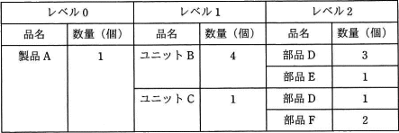

# [平成30年秋期 午前 問73](https://www.ap-siken.com/kakomon/30_aki/q73.html)

#問題 #ストラテジ #ビジネスインダストリ #エンジニアリングシステム

解説を表示解説を隠す

<strong>問73</strong>　ある期間の生産計画において，表の部品表で表される製品Aの需要量が10個であるとき，部品Dの正味所要量は何個か。ここで，ユニットBの在庫残が5個，部品Dの在庫残が25個あり，ほかの在庫残，仕掛残，注文残，引当残などはないものとする。 

<ul class="ap-choices">
<li class="ap-choice-item ap-wrong">

ア　80

ユニットC由来の部品Dを含めず、ユニットB分だけから部品Dの在庫を差し引いた場合（35×3－25＝80）です。

</li>
<li class="ap-choice-item ap-correct">

イ　90

正しい。部品表に沿って段階的に所要量を積み上げ、在庫残を差し引いた部品Dの正味所要量です。詳細：<a href="用語/MRP" class="internal-link" data-href="用語/MRP">MRP</a>

</li>
<li class="ap-choice-item ap-wrong">

ウ　95

本問の部品表・在庫残に基づく正味所要量の計算結果ではありません。

</li>
<li class="ap-choice-item ap-wrong">

エ　105

ユニットBの在庫残を考慮せずに計算した場合（40×3＋10－25＝105）です。

</li>
</ul>

<h4>解説</h4>

まず製品Aを生産するのに必要となる部品Dの数量をユニット→部品という形で段階的に計算しています。 1個の製品Aは、4個のユニットBと1個のユニットCで構成されます。ユニットBの在庫残が5個あることを考慮すると、各ユニットの正味所要数はそれぞれ次のようになります。 ユニットB：4×10－5＝35（個） ユニットC：1×10＝10（個） 続いてユニットを生産するための必要な部品Dの数量を求めます。1個のユニットBには3個の部品Dが、1個のユニットCには1個の部品Dが必要です。また部品Dには25個の在庫残があるため、計算式は以下のようになります。 (35×3)＋(10×1)－25＝90（個） 以上より、この生産計画における部品Dの正味所要量は90個であることがわかります。

