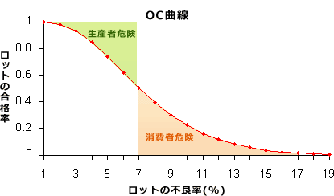

# [平成30年秋期 午前 問75](https://www.ap-siken.com/kakomon/30_aki/q75.html)

#問題 #ストラテジ #企業活動 #業務分析・データ利活用

解説を表示解説を隠す

<strong>問75</strong>　横軸にロットの不良率，縦軸にロットの合格率をとり，抜取検査でのロットの品質とその合格率の関係を表したものはどれか。

<ul class="ap-choices">
<li class="ap-choice-item ap-correct">

ア　OC曲線

正しい。詳細：<a href="用語/OC曲線" class="internal-link" data-href="用語/OC曲線">OC曲線</a>

</li>
<li class="ap-choice-item ap-wrong">

イ　バスタブ曲線

詳細：<a href="用語/バスタブ曲線" class="internal-link" data-href="用語/バスタブ曲線">バスタブ曲線</a>

</li>
<li class="ap-choice-item ap-wrong">

ウ　ポアソン分布

詳細：<a href="用語/ポアソン分布" class="internal-link" data-href="用語/ポアソン分布">ポアソン分布</a>

</li>
<li class="ap-choice-item ap-wrong">

エ　ワイブル分布

詳細：ワイブル分布

</li>
</ul>

<h4>解説</h4>

<a href="用語/OC曲線" class="internal-link" data-href="用語/OC曲線">OC曲線</a>(Operating Characteristic curve)は、ロットの<a href="用語/不良率" class="internal-link" data-href="用語/不良率">不良率</a>とそのロットの合格率の関係を表したグラフです。ロットの<a href="用語/不良率" class="internal-link" data-href="用語/不良率">不良率</a>がnである場合にロットの合格率が一意に決まることを表しています。

製品の<a href="用語/抜き取り検査" class="internal-link" data-href="用語/抜き取り検査">抜き取り検査</a>では、ロットからn個のサンプルをとり、それに含まれる不良品個数が c個以上であればそのロットを不合格とするという判定を行います。<a href="用語/OC曲線" class="internal-link" data-href="用語/OC曲線">OC曲線</a>は、nおよびcを固定とした場合のロットの合格率(p)を縦軸に、実際のロットの<a href="用語/不良率" class="internal-link" data-href="用語/不良率">不良率</a>(ｑ)を横軸に取り、pとqの関係を表した曲線です。

この曲線上において、本来合格となるべきロットが、<a href="用語/抜き取り検査" class="internal-link" data-href="用語/抜き取り検査">抜き取り検査</a>で不合格になってしまう確率を<a href="用語/生産者危険" class="internal-link" data-href="用語/生産者危険">生産者危険</a>、本来不合格となるべきロットが合格になってしまう確率を<a href="用語/消費者危険" class="internal-link" data-href="用語/消費者危険">消費者危険</a>といいます。

<a href="用語/バスタブ曲線" class="internal-link" data-href="用語/バスタブ曲線">バスタブ曲線</a>は、<a href="用語/故障率曲線" class="internal-link" data-href="用語/故障率曲線">故障率曲線</a>とも呼ばれ、機械や装置の時間経過に伴う故障率の変化を表示した曲線です。

<a href="用語/ポアソン分布" class="internal-link" data-href="用語/ポアソン分布">ポアソン分布</a>は、非常に大きな集団においてきわめて起こりにくい事象を対象としたときの分布です。

ワイブル分布は、物体の体積と強度との関係を定量的に記述するための確率分布で、部品などの寿命特性を統計的に記述するために利用されます。

