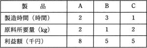

# [平成30年秋期 午前 問76](https://www.ap-siken.com/kakomon/30_aki/q76.html)

#問題 #ストラテジ #企業活動 #業務分析・データ利活用

解説を表示解説を隠す

<strong>問76</strong>　工場で，ある原料から生産している3種類の製品A，B及びCの単位量当たりの製造時間，原料所要量及び利益額を表に示す。この工場の月間合計製造時間は最大240時間であり，投入可能な原料は月間150kgである。このとき，各製品をそれぞれどれだけ作ると最も高い利益が得られるかを求めるのに用いられる手法はどれか。 

<ul class="ap-choices">
<li class="ap-choice-item ap-wrong">

ア　移動平均法

<a href="用語/移動平均法" class="internal-link" data-href="用語/移動平均法">移動平均法</a>は，時系列のデータを平滑化することで売上予測などに用いられる手法です。

</li>
<li class="ap-choice-item ap-wrong">

イ　最小二乗法

<a href="用語/最小二乗法" class="internal-link" data-href="用語/最小二乗法">最小二乗法</a>は，<a href="用語/散布図" class="internal-link" data-href="用語/散布図">散布図</a>にプロットされた複数の点を基に数学的に回帰直線を導く方法です。

</li>
<li class="ap-choice-item ap-correct">

ウ　線形計画法

正しい。詳細：<a href="用語/線形計画法" class="internal-link" data-href="用語/線形計画法">線形計画法</a>

</li>
<li class="ap-choice-item ap-wrong">

エ　定量発注法

定量発注法は，在庫を補充するための発注方式の一つです。

</li>
</ul>

<h4>解説</h4>

<a href="用語/線形計画法" class="internal-link" data-href="用語/線形計画法">線形計画法</a>は，1次式を満たす変数の値の中で式を最大化または最小化する値を求める方法です。在庫としてもつ原材料を使用して最大の利益を得るための販売量や，機械の稼働時間を最大限に生かして製造する製品など，限りある資源を最大限に活用したい場合にその組合せを得るために用いられます。

