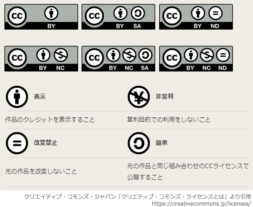

# [平成30年秋期 午前 問78](https://www.ap-siken.com/kakomon/30_aki/q78.html)

#問題 #ストラテジ #法務 #知的財産権

解説を表示解説を隠す

<strong>問78</strong>　クリエイティブコモンズの説明はどれか。

<ul class="ap-choices">
<li class="ap-choice-item ap-wrong">

ア　公共の図書館などにおいては，営利を目的としない場合に限り，一定の条件の下で著作物を複製し，利用者に提供することが許されるという規定

<a href="用語/著作権法" class="internal-link" data-href="用語/著作権法">著作権法</a>31条の規定です。

</li>
<li class="ap-choice-item ap-wrong">

イ　著作物とは，思想や感情を創作的に表現したものであり，文芸，学術，美術又は音楽の領域に属すものであるという定義

<a href="用語/著作権法" class="internal-link" data-href="用語/著作権法">著作権法</a>2条1項1号の定義です。

</li>
<li class="ap-choice-item ap-correct">

ウ　著作物の共有をより円滑に行うために，再利用の許諾条件を著作者があらかじめ明示する枠組みを策定して普及させようとする活動及びその運営主体である団体名

正しい。<a href="用語/クリエイティブコモンズ" class="internal-link" data-href="用語/クリエイティブコモンズ">クリエイティブコモンズ</a>の説明です。

</li>
<li class="ap-choice-item ap-wrong">

エ　著作物の保護期間は，著作者の生存期間，及び著作者の死後少なくとも50年間とし，それ以降，著作権は消滅するという考え方

<a href="用語/著作権法" class="internal-link" data-href="用語/著作権法">著作権法</a>51条の規定です。※2018年12月30日に改正<a href="用語/著作権法" class="internal-link" data-href="用語/著作権法">著作権法</a>が施行され、映画以外の著作物についての保護期間が50年から70年に延長されました（映画は元から70年）。2019年現在における<a href="用語/著作権" class="internal-link" data-href="用語/著作権">著作権</a>の原則的保護期間は、著作物の作成時点から著作者が生存している間及び著作者の死後70年となります。

</li>
</ul>

<h4>解説</h4>

<a href="用語/クリエイティブコモンズ" class="internal-link" data-href="用語/クリエイティブコモンズ">クリエイティブコモンズ</a>は、クリエイティブ・コモンズ・ライセンス（CCライセンス）を提供している国際的非営利組織とそのプロジェクトの総称です。

CCライセンスとはインターネット時代のための新しい<a href="用語/著作権" class="internal-link" data-href="用語/著作権">著作権</a>ルールで、作品を公開する作者が「この条件を守れば私の作品を自由に使って構いません」という意思表示をするためのツールです。CCライセンスを利用することで、作者は<a href="用語/著作権" class="internal-link" data-href="用語/著作権">著作権</a>を保持したまま作品を自由に流通させることができ、受け手はライセンス条件の範囲内で再配布やリミックスなどをすることができます。

したがって「ウ」が適切な説明です。

