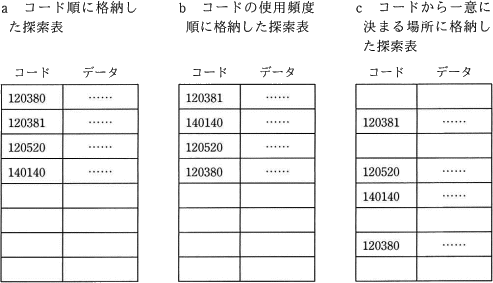
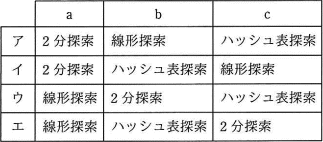

# [平成30年秋期 午前 問8](https://www.ap-siken.com/kakomon/30_aki/q8.html)

#問題 #テクノロジ #アルゴリズムとプログラミング #アルゴリズム

解説を表示解説を隠す

<strong>問8</strong>　探索表の構成法を例とともに a～c に示す。最も適した探索手法の組合せはどれか。ここで，探索表のコードの空欄は表の空きを示す。  

<ul class="ap-choices">
<li class="ap-choice-item ap-correct">

ア

正しい。a＝<a href="用語/2分探索法" class="internal-link" data-href="用語/2分探索法">2分探索</a>、b＝<a href="用語/線形探索法" class="internal-link" data-href="用語/線形探索法">線形探索</a>、c＝<a href="用語/ハッシュ表探索法" class="internal-link" data-href="用語/ハッシュ表探索法">ハッシュ表探索</a>です。

</li>
<li class="ap-choice-item ap-wrong">

イ

a～cの組合せが誤っています。組合せは選択肢表を参照してください。

</li>
<li class="ap-choice-item ap-wrong">

ウ

a～cの組合せが誤っています。組合せは選択肢表を参照してください。

</li>
<li class="ap-choice-item ap-wrong">

エ

a～cの組合せが誤っています。組合せは選択肢表を参照してください。

</li>
</ul>

<h4>解説</h4>

[a コード順に格納した探索表] 探索表はコード順に整列済みなので、<a href="用語/線形探索法" class="internal-link" data-href="用語/線形探索法">線形探索</a>または<a href="用語/2分探索法" class="internal-link" data-href="用語/2分探索法">2分探索</a>を使用可能です。各探索法の平均探索回数は、<a href="用語/線形探索法" class="internal-link" data-href="用語/線形探索法">線形探索</a>が (N＋1)／2 回、<a href="用語/2分探索法" class="internal-link" data-href="用語/2分探索法">2分探索法</a>が [log2N] 回ですので、探索表の要素数が同じならば平均探索回数は<a href="用語/2分探索法" class="internal-link" data-href="用語/2分探索法">2分探索</a>のほうが少なくて済みます。したがってa表には<a href="用語/2分探索法" class="internal-link" data-href="用語/2分探索法">2分探索</a>が適切です。(※[n]はnを超えない最大の整数を表します)

[b コードの使用頻度順に格納した探索表] 使用頻度が高いデータほど探索表の先頭のほうに位置していることになります。<a href="用語/線形探索法" class="internal-link" data-href="用語/線形探索法">線形探索</a>では探索表の先頭から順番に探索していくので、このような探索表に対しては効率的に探索できます。 <a href="用語/2分探索法" class="internal-link" data-href="用語/2分探索法">2分探索法</a>は、データが整列されていないと使えないという制限がありますし、この表はハッシュ法に対応していないので、b表に対しては<a href="用語/線形探索法" class="internal-link" data-href="用語/線形探索法">線形探索</a>が唯一使用できる方法となります。

[c コードから一意に決まる場所に格納した探索表] ハッシュ法は、探索データのキー値から、そのデータの格納場所(アドレス)を直接計算する方法で、(シノニムが発生しなければ)1回の計算で一意に目的のデータにたどりつけます。 1回の探索でいいので、このc表に対して最も計算量が少なくなる探索法は<a href="用語/ハッシュ表探索法" class="internal-link" data-href="用語/ハッシュ表探索法">ハッシュ表探索</a>です。

したがって、a＝<a href="用語/2分探索法" class="internal-link" data-href="用語/2分探索法">2分探索</a>、b＝<a href="用語/線形探索法" class="internal-link" data-href="用語/線形探索法">線形探索</a>、c＝<a href="用語/ハッシュ表探索法" class="internal-link" data-href="用語/ハッシュ表探索法">ハッシュ表探索</a>の組合せが正解です。

