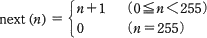
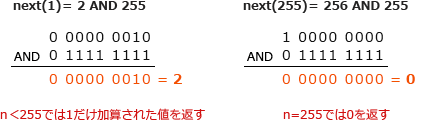
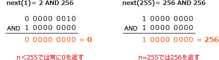
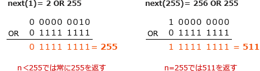
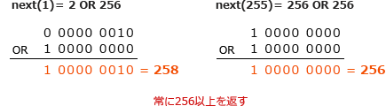

# [平成31年春期 午前 問1](https://www.ap-siken.com/kakomon/31_haru/q1.html)

#問題 #テクノロジ #基礎理論 #離散数学

解説を表示解説を隠す

<strong>問1</strong>　0以上255以下の整数nに対して，と定義する。next(n)と等しい式はどれか。ここで，x AND y 及び x OR y は，それぞれxとyを2進数表現にして，桁ごとの論理積及び論理和をとったものとする。

<ul class="ap-choices">
<li class="ap-choice-item ap-correct">

ア　(n＋1) AND 255

正しい。<a href="用語/ビット" class="internal-link" data-href="用語/ビット">ビット</a>マスクの255を2進数で表すと「11111111」で、この<a href="用語/ビット" class="internal-link" data-href="用語/ビット">ビット</a>列との<a href="用語/論理積" class="internal-link" data-href="用語/論理積">論理積</a>(AND)は(n＋1)の下位8<a href="用語/ビット" class="internal-link" data-href="用語/ビット">ビット</a>だけを取り出すように作用する。引数が255の場合には、最上位<a href="用語/ビット" class="internal-link" data-href="用語/ビット">ビット</a>の演算結果が0になるので<a href="用語/関数" class="internal-link" data-href="用語/関数">関数</a>は0を返す。

</li>
<li class="ap-choice-item ap-wrong">

イ　(n＋1) AND 256

<a href="用語/ビット" class="internal-link" data-href="用語/ビット">ビット</a>マスクの256を2進数で表すと「1 00000000」である。どの引数を与えても下位8<a href="用語/ビット" class="internal-link" data-href="用語/ビット">ビット</a>の演算結果が常に0になってしまうため誤り。

</li>
<li class="ap-choice-item ap-wrong">

ウ　(n＋1) OR 255

<a href="用語/ビット" class="internal-link" data-href="用語/ビット">ビット</a>マスクの255を2進数で表すと「11111111」で、この<a href="用語/ビット" class="internal-link" data-href="用語/ビット">ビット</a>列と<a href="用語/論理和" class="internal-link" data-href="用語/論理和">論理和</a>(OR)演算を行った結果の下位8<a href="用語/ビット" class="internal-link" data-href="用語/ビット">ビット</a>は常に「11111111」になる。0≦n＜255では常に255、255では511が返るため誤り。

</li>
<li class="ap-choice-item ap-wrong">

エ　(n＋1) OR 256

<a href="用語/ビット" class="internal-link" data-href="用語/ビット">ビット</a>マスクの256を2進数で表すと「1 00000000」で、この<a href="用語/ビット" class="internal-link" data-href="用語/ビット">ビット</a>列と<a href="用語/論理和" class="internal-link" data-href="用語/論理和">論理和</a>(OR)演算を行った結果の最上位<a href="用語/ビット" class="internal-link" data-href="用語/ビット">ビット</a>は常に1になる。どの引数を与えても常に256以上の値が返るため誤り。

</li>
</ul>

<h4>解説</h4>

next(n)は、引数nが0～254の場合には引数に1を加えた値を返し、255では0を返す。

この問題で考えなければならないポイントは、次の2点である。

<ul>
<li>1ずつ加算がおこなわれるか。</li>
<li>next(255)のときに結果が 0 となるか。</li>
</ul>

この点を検証するためにnext(1)とnext(255)の結果をそれぞれ考える。

正しい。<a href="用語/ビット" class="internal-link" data-href="用語/ビット">ビット</a>マスクの255を2進数で表すと「11111111」で、この<a href="用語/ビット" class="internal-link" data-href="用語/ビット">ビット</a>列との<a href="用語/論理積" class="internal-link" data-href="用語/論理積">論理積</a>(AND)は(n＋1)の下位8<a href="用語/ビット" class="internal-link" data-href="用語/ビット">ビット</a>だけを取り出すように作用します。引数が255の場合には、最上位<a href="用語/ビット" class="internal-link" data-href="用語/ビット">ビット</a>の演算結果が0になるので<a href="用語/関数" class="internal-link" data-href="用語/関数">関数</a>は0を返します。 

<a href="用語/ビット" class="internal-link" data-href="用語/ビット">ビット</a>マスクの256を2進数で表すと「1 00000000」です。どの引数を与えても下位8<a href="用語/ビット" class="internal-link" data-href="用語/ビット">ビット</a>の演算結果が常に0になってしまうため誤りです。 

<a href="用語/ビット" class="internal-link" data-href="用語/ビット">ビット</a>マスクの255を2進数で表すと「11111111」で、この<a href="用語/ビット" class="internal-link" data-href="用語/ビット">ビット</a>列と<a href="用語/論理和" class="internal-link" data-href="用語/論理和">論理和</a>(OR)演算を行った結果の下位8<a href="用語/ビット" class="internal-link" data-href="用語/ビット">ビット</a>は常に「11111111」になります。0≦n＜255では常に255、255では511が返るため誤りです。 

<a href="用語/ビット" class="internal-link" data-href="用語/ビット">ビット</a>マスクの256を2進数で表すと「1 00000000」で、この<a href="用語/ビット" class="internal-link" data-href="用語/ビット">ビット</a>列と<a href="用語/論理和" class="internal-link" data-href="用語/論理和">論理和</a>(OR)演算を行った結果の最上位<a href="用語/ビット" class="internal-link" data-href="用語/ビット">ビット</a>は常に1になります。どの引数を与えても常に256以上の値が返るため誤りです。 

