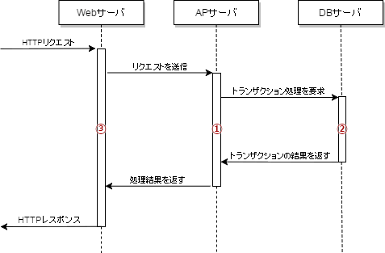

# [平成31年春期 午前 問12](https://www.ap-siken.com/kakomon/31_haru/q12.html)

#問題 #テクノロジ #システム構成要素 #システムの構成

解説を表示解説を隠す

<strong>問12</strong>　Webサーバ，アプリケーション(AP)サーバ及びデータベース(DB)サーバが各1台で構成されるWebシステムにおいて，次の3種類のタイムアウトを設定した。タイムアウトに設定する時間の長い順に並べたものはどれか。ここで，トランザクションはWebリクエスト内で処理を完了するものとする。  〔タイムアウトの種類〕 ① APサーバのAPが，処理を開始してから終了するまで ② APサーバのAPにおいて，DBアクセスなどのトランザクションを開始してから終了するまで ③ Webサーバが，APサーバにリクエストを送信してから返信を受けるまで

<ul class="ap-choices">
<li class="ap-choice-item ap-wrong">

ア　①，③，②

①を最長にしている。<a href="用語/Webサーバ" class="internal-link" data-href="用語/Webサーバ">Webサーバ</a>の待ち（③）がAP処理（①）を包含するため誤り。

</li>
<li class="ap-choice-item ap-wrong">

イ　②，①，③

<a href="用語/トランザクション" class="internal-link" data-href="用語/トランザクション">トランザクション</a>（②）を最長にしている。②は①の内側、①は③の内側なので誤り。

</li>
<li class="ap-choice-item ap-correct">

ウ　③，①，②

正しい。入れ子関係により③＞①＞②となる。

</li>
<li class="ap-choice-item ap-wrong">

エ　③，②，①

③を最長にしたうえで①と②の順が逆。<a href="用語/トランザクション" class="internal-link" data-href="用語/トランザクション">トランザクション</a>（②）はAP処理（①）の内側なので誤り。

</li>
</ul>

<h4>解説</h4>

設問の〔タイムアウトの種類〕の記述から、<a href="用語/Webシステム" class="internal-link" data-href="用語/Webシステム">Webシステム</a>の処理手順は以下のようになっていることがわかります。

<ol>
<li><a href="用語/Webサーバ" class="internal-link" data-href="用語/Webサーバ">Webサーバ</a>は、APサーバにリクエストを送信する</li>
<li>APサーバは、処理を開始する</li>
<li>APサーバは、<a href="用語/トランザクション" class="internal-link" data-href="用語/トランザクション">トランザクション</a>処理のためにDBサーバにアクセスする</li>
<li>DBサーバは、<a href="用語/トランザクション" class="internal-link" data-href="用語/トランザクション">トランザクション</a>を処理する</li>
<li>DBサーバは、APサーバに結果を返す</li>
<li>APサーバは、受け取った結果を処理し、<a href="用語/Webサーバ" class="internal-link" data-href="用語/Webサーバ">Webサーバ</a>に返す</li>
<li><a href="用語/Webサーバ" class="internal-link" data-href="用語/Webサーバ">Webサーバ</a>は、APサーバから結果を受け取る</li>
</ol>

この流れを<a href="用語/シーケンス図" class="internal-link" data-href="用語/シーケンス図">シーケンス図</a>で表すと次のようになります。 

各処理は連鎖的に行われるため処理時間の長さは常に「<a href="用語/Webサーバ" class="internal-link" data-href="用語/Webサーバ">Webサーバ</a>＞APサーバ＞DBサーバ」になります。したがって、設定すべきタイムアウト時間の長さも「③＞①＞②」になります。

