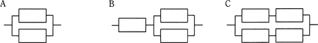

# [平成31年春期 午前 問13](https://www.ap-siken.com/kakomon/31_haru/q13.html)

#問題 #テクノロジ #システム構成要素 #システムの評価指標

解説を表示解説を隠す

<strong>問13</strong>　稼働率の等しい装置を直列や並列に組み合わせたとき，システム全体の稼働率を高い順に並べたものはどれか。ここで，各装置の稼働率は0より大きく1未満である。 

<ul class="ap-choices">
<li class="ap-choice-item ap-wrong">

ア　A，B，C

Bの<a href="用語/稼働率" class="internal-link" data-href="用語/稼働率">稼働率</a>はAより低く、CはBより高いため、この順序は正しくありません。

</li>
<li class="ap-choice-item ap-correct">

イ　A，C，B

正しい。Aが最も高く、次いでC、Bの順になります。

</li>
<li class="ap-choice-item ap-wrong">

ウ　C，A，B

Aの<a href="用語/稼働率" class="internal-link" data-href="用語/稼働率">稼働率</a>はCより高いため、この順序は正しくありません。

</li>
<li class="ap-choice-item ap-wrong">

エ　C，B，A

Aの<a href="用語/稼働率" class="internal-link" data-href="用語/稼働率">稼働率</a>が最も高いため、この順序は正しくありません。

</li>
</ul>

<h4>解説</h4>

各装置の<a href="用語/稼働率" class="internal-link" data-href="用語/稼働率">稼働率</a>は等しく、0より大きく1未満とあるので、仮に<a href="用語/稼働率" class="internal-link" data-href="用語/稼働率">稼働率</a>0.9を当てはめてみて、システム全体の<a href="用語/稼働率" class="internal-link" data-href="用語/稼働率">稼働率</a>を比較します。直列接続の<a href="用語/稼働率" class="internal-link" data-href="用語/稼働率">稼働率</a>を求める式はR2、並列接続の<a href="用語/稼働率" class="internal-link" data-href="用語/稼働率">稼働率</a>を求める式は「1－(1－R)2」です。

【A】 2台の並列接続なので、 1－(1－0.9)2 ＝1－0.12 ＝1－0.01＝0.99

【B】 <a href="用語/稼働率" class="internal-link" data-href="用語/稼働率">稼働率</a>0.99であるAの構成部分に、装置1台が直列接続されているので、 0.9×0.99＝0.891

【C】 装置2台の直列接続は、0.9×0.9＝0.81 <a href="用語/稼働率" class="internal-link" data-href="用語/稼働率">稼働率</a>0.81の構成部分が、並列に接続されているので、 1－(1－0.81)2 ＝1－0.192 ＝1－0.0361＝0.9639

したがって、<a href="用語/稼働率" class="internal-link" data-href="用語/稼働率">稼働率</a>の高い順に「A，C，B」となります。

【別解】 各システムの<a href="用語/稼働率" class="internal-link" data-href="用語/稼働率">稼働率</a>を式で表して、それを比較する論理的な解法です。各装置の<a href="用語/稼働率" class="internal-link" data-href="用語/稼働率">稼働率</a>をRとします。

Aの<a href="用語/稼働率" class="internal-link" data-href="用語/稼働率">稼働率</a>：1－(1－R)2 … aとする Bの<a href="用語/稼働率" class="internal-link" data-href="用語/稼働率">稼働率</a>：R×[Aのシステム構成]なので、Ra Cの<a href="用語/稼働率" class="internal-link" data-href="用語/稼働率">稼働率</a>：1－(1－R2)2

それぞれの<a href="用語/稼働率" class="internal-link" data-href="用語/稼働率">稼働率</a>の大小を比較します。

AとB：0＜R＜1なので「a＞Ra」、よってA＞B

AとC：1から減じる部分を比較すると、0＜R＜1なので「(1－R)＜(1－R2)」、よってA＞C

BとC：Bの<a href="用語/稼働率" class="internal-link" data-href="用語/稼働率">稼働率</a> Ra を展開すると、 R(1－(1－R)2)＝R(1－(1－2R＋R2)) ＝R(1－1＋2R－R2)＝R(2R－R2) ＝R2(2－R)  Cの<a href="用語/稼働率" class="internal-link" data-href="用語/稼働率">稼働率</a>を展開すると、 1－(1－R2)2＝1－(1－2R2＋R4) ＝1－1＋2R2－R4＝2R2－R4 ＝R2(2－R2)  R2に乗ずる部分を比較すると、0＜R＜1なので「2－R＜2－R2」、よってB＜C

以上より、3つのシステム構成を<a href="用語/稼働率" class="internal-link" data-href="用語/稼働率">稼働率</a>が高い順に並べると「A，C，B」になります。

