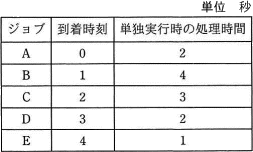
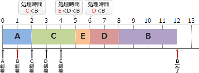

# [平成31年春期 午前 問16](https://www.ap-siken.com/kakomon/31_haru/q16.html)

#問題 #テクノロジ #ソフトウェア #オペレーティングシステム

解説を表示解説を隠す

<strong>問16</strong>　五つのジョブA～Eに対して，ジョブの多重度が1で，処理時間順方式のスケジューリングを適用した場合，ジョブBのターンアラウンドタイムは何秒か。ここで，OSのオーバーヘッドは考慮しないものとする。 

<ul class="ap-choices">
<li class="ap-choice-item ap-wrong">

ア　8

処理順序や完了時刻の取り違えによる誤り。

</li>
<li class="ap-choice-item ap-wrong">

イ　9

処理順序や完了時刻の取り違えによる誤り。

</li>
<li class="ap-choice-item ap-wrong">

ウ　10

処理順序や完了時刻の取り違え、または到着時刻の差し引きミスによる誤り。

</li>
<li class="ap-choice-item ap-correct">

エ　11

正しい。ジョブBの到着（開始から1秒後）から完了（12秒後）までの差が11秒。

</li>
</ul>

<h4>解説</h4>

<a href="用語/ターンアラウンドタイム" class="internal-link" data-href="用語/ターンアラウンドタイム">ターンアラウンドタイム</a>は、入力の開始を始めたときからすべての出力を受け取るまでに要する時間のことをいいます。

<a href="用語/処理時間順方式" class="internal-link" data-href="用語/処理時間順方式">処理時間順方式</a>は、処理時間の短い<a href="用語/タスク" class="internal-link" data-href="用語/タスク">タスク</a>を優先的に実行する<a href="用語/スケジューリング" class="internal-link" data-href="用語/スケジューリング">スケジューリング</a>方式です。新たな<a href="用語/タスク" class="internal-link" data-href="用語/タスク">タスク</a>が到着すると処理の待ち行列に加わり、<a href="用語/CPU" class="internal-link" data-href="用語/CPU">CPU</a>が空くと待ち行列の中から予想処理時間が最も短い<a href="用語/タスク" class="internal-link" data-href="用語/タスク">タスク</a>が選択され、実行状態に移されます。またジョブの多重度が1なので、<a href="用語/CPU" class="internal-link" data-href="用語/CPU">CPU</a>は同時に1つのジョブしか処理できません。

これらの条件に従うと、<a href="用語/CPU" class="internal-link" data-href="用語/CPU">CPU</a>は次のようにジョブを処理していくことになります。

<ol>
<li>【開始時点】到着しているのはジョブAだけなので、<a href="用語/CPU" class="internal-link" data-href="用語/CPU">CPU</a>はジョブAの処理を開始する。</li>
<li>【1秒後】ジョブBが到着する。<a href="用語/CPU" class="internal-link" data-href="用語/CPU">CPU</a>はジョブAの処理を続ける。</li>
<li>【2秒後】ジョブAの処理が完了する。同時にジョブCが到着する。 未処理の<a href="用語/タスク" class="internal-link" data-href="用語/タスク">タスク</a>の処理時間を比較するとB＞Cなので、<a href="用語/CPU" class="internal-link" data-href="用語/CPU">CPU</a>はジョブCの処理を開始する。</li>
<li>【3秒後】ジョブDが到着する。<a href="用語/CPU" class="internal-link" data-href="用語/CPU">CPU</a>はジョブCの処理を続ける。 ※処理時間はC＞Dですが、<a href="用語/処理時間順方式" class="internal-link" data-href="用語/処理時間順方式">処理時間順方式</a>はノンプリエンプティブな方式なので<a href="用語/タスク" class="internal-link" data-href="用語/タスク">タスク</a>の切替えは発生しません。</li>
<li>【4秒後】ジョブEが到着する。<a href="用語/CPU" class="internal-link" data-href="用語/CPU">CPU</a>はジョブCの処理を続ける。</li>
<li>【5秒後】ジョブCの処理が完了する。 未処理の<a href="用語/タスク" class="internal-link" data-href="用語/タスク">タスク</a>の処理時間を比較するとE＜D＜Bなので、<a href="用語/CPU" class="internal-link" data-href="用語/CPU">CPU</a>はジョブEの処理を開始する。</li>
<li>【6秒後】ジョブEの処理が完了する。 未処理の<a href="用語/タスク" class="internal-link" data-href="用語/タスク">タスク</a>の処理時間を比較するとD＜Bなので、<a href="用語/CPU" class="internal-link" data-href="用語/CPU">CPU</a>はジョブDの処理を開始する。</li>
<li>【8秒後】ジョブDの処理が完了する。 <a href="用語/CPU" class="internal-link" data-href="用語/CPU">CPU</a>は最後に残ったジョブBの処理を開始する。</li>
<li>【12秒後】ジョブBの処理が完了し、全てのジョブの処理が完了する。</li>
</ol>

このように<a href="用語/タスク" class="internal-link" data-href="用語/タスク">タスク</a>の完了順は「A→C→E→D→B」となります。ジョブBが到着したのは開始から1秒後ですから、ジョブBの<a href="用語/ターンアラウンドタイム" class="internal-link" data-href="用語/ターンアラウンドタイム">ターンアラウンドタイム</a>は、全体の処理時間12秒から1秒を引いた11秒となります。したがって「エ」が正解です。 

