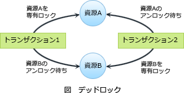

# [平成31年春期 午前 問18](https://www.ap-siken.com/kakomon/31_haru/q18.html)

#問題 #テクノロジ #ソフトウェア #オペレーティングシステム

解説を表示解説を隠す

<strong>問18</strong>　二つのタスクが共用する二つの資源を排他的に使用するとき，デッドロックが発生するおそれがある。このデッドロックの発生を防ぐ方法はどれか。

<ul class="ap-choices">
<li class="ap-choice-item ap-wrong">

ア　一方のタスクの優先度を高くする。

一方の<a href="用語/タスク" class="internal-link" data-href="用語/タスク">タスク</a>の優先度を上げても、他方の<a href="用語/タスク" class="internal-link" data-href="用語/タスク">タスク</a>が保持している<a href="用語/資源" class="internal-link" data-href="用語/資源">資源</a>はそのことで解放されないため、<a href="用語/デッドロック" class="internal-link" data-href="用語/デッドロック">デッドロック</a>は防止できません。

</li>
<li class="ap-choice-item ap-correct">

イ　資源獲得の順序を両方のタスクで同じにする。

正しい。<a href="用語/デッドロック" class="internal-link" data-href="用語/デッドロック">デッドロック</a>の発生を防ぐには、共有<a href="用語/資源" class="internal-link" data-href="用語/資源">資源</a>の使用順序を同じにします。仮に<a href="用語/タスク" class="internal-link" data-href="用語/タスク">タスク</a>Aが「X→Y→Z」という順で<a href="用語/資源" class="internal-link" data-href="用語/資源">資源</a>を獲得をするなら、<a href="用語/タスク" class="internal-link" data-href="用語/タスク">タスク</a>Bも同じく「X→Y→Z」で<a href="用語/資源" class="internal-link" data-href="用語/資源">資源</a>を獲得するようにします。

</li>
<li class="ap-choice-item ap-wrong">

ウ　資源獲得の順序を両方のタスクで逆にする。

<a href="用語/デッドロック" class="internal-link" data-href="用語/デッドロック">デッドロック</a>は、複数の<a href="用語/タスク" class="internal-link" data-href="用語/タスク">タスク</a>間で<a href="用語/資源" class="internal-link" data-href="用語/資源">資源</a>獲得の順番が異なるときに起こります。<a href="用語/資源" class="internal-link" data-href="用語/資源">資源</a>の取得順を逆にすれば、<a href="用語/デッドロック" class="internal-link" data-href="用語/デッドロック">デッドロック</a>が発生しやすくなります。

</li>
<li class="ap-choice-item ap-wrong">

エ　両方のタスクの優先度を同じにする。

<a href="用語/タスク" class="internal-link" data-href="用語/タスク">タスク</a>の優先度を揃えても、<a href="用語/デッドロック" class="internal-link" data-href="用語/デッドロック">デッドロック</a>の発生を防ぐことはできません。

</li>
</ul>

<h4>解説</h4>

<a href="用語/デッドロック" class="internal-link" data-href="用語/デッドロック">デッドロック</a>は、共有<a href="用語/資源" class="internal-link" data-href="用語/資源">資源</a>を使用する2つ以上の<a href="用語/プロセス" class="internal-link" data-href="用語/プロセス">プロセス</a>が、互いに相手<a href="用語/プロセス" class="internal-link" data-href="用語/プロセス">プロセス</a>が必要とする<a href="用語/資源" class="internal-link" data-href="用語/資源">資源</a>を排他的に使用していて、互いの<a href="用語/プロセス" class="internal-link" data-href="用語/プロセス">プロセス</a>が相手の使用している<a href="用語/資源" class="internal-link" data-href="用語/資源">資源</a>の解放を待っている状態です。<a href="用語/デッドロック" class="internal-link" data-href="用語/デッドロック">デッドロック</a>が発生すると双方の<a href="用語/プロセス" class="internal-link" data-href="用語/プロセス">プロセス</a>が永遠に待ち状態になってしまい、処理の続行ができなくなってしまいます。

