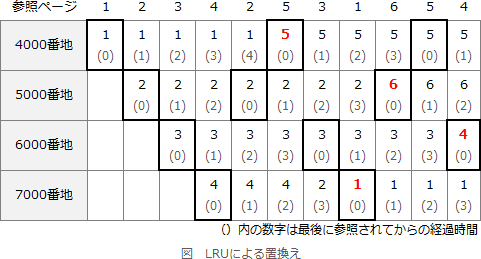

# [平成31年春期 午前 問19](https://www.ap-siken.com/kakomon/31_haru/q19.html)

#問題 #テクノロジ #ソフトウェア #オペレーティングシステム

解説を表示解説を隠す

<strong>問19</strong>　仮想記憶管理におけるページ置換えアルゴリズムとしてLRU方式を採用する。主記憶のページ枠が，4000，5000，6000，7000番地(いずれも16進数)の4ページ分で，プログラムが参照するページ番号の順が，1→2→3→4→2→5→3→1→6→5→4のとき，最後の参照ページ4は何番地にページインされているか。ここで，最初の1→2→3→4の参照で，それぞれのページは4000，5000，6000，7000番地にページインされるものとする。

<ul class="ap-choices">
<li class="ap-choice-item ap-wrong">

ア　4000

<a href="用語/LRU" class="internal-link" data-href="用語/LRU">LRU</a>によるページ枠の遷移追跡ミス。

</li>
<li class="ap-choice-item ap-wrong">

イ　5000

<a href="用語/LRU" class="internal-link" data-href="用語/LRU">LRU</a>によるページ枠の遷移追跡ミス。

</li>
<li class="ap-choice-item ap-correct">

ウ　6000

正しい。最終状態でページ4は左から3番目（6000番地）に<a href="用語/ページイン" class="internal-link" data-href="用語/ページイン">ページイン</a>される。

</li>
<li class="ap-choice-item ap-wrong">

エ　7000

<a href="用語/LRU" class="internal-link" data-href="用語/LRU">LRU</a>によるページ枠の遷移追跡ミス。

</li>
</ul>

<h4>解説</h4>

<a href="用語/LRU" class="internal-link" data-href="用語/LRU">LRU</a>(Least Recently Used)は、置換え対象の中で最後に参照されてからの時間が最も長いページを置換え対象とするアルゴリズムです。

ページ枠の遷移を順を追って考えていきます。下記解説のページ枠は左から順に、4000、5000、6000、7000番地を表すものとします。

<ul>
<li>最初の1→2→3→4までは設問の指示どおりに<a href="用語/ページイン" class="internal-link" data-href="用語/ページイン">ページイン</a>します。</li>
<li>2の参照 - 2は<a href="用語/主記憶" class="internal-link" data-href="用語/主記憶">主記憶</a>に存在するので置換えは発生しません。</li>
<li>5の参照 - 5は<a href="用語/主記憶" class="internal-link" data-href="用語/主記憶">主記憶</a>に存在しないので置換えが必要になります。4つのページのうち最も長い時間参照されていないページ（以下、対象ページという）は1なので、1が<a href="用語/ページアウト" class="internal-link" data-href="用語/ページアウト">ページアウト</a>され、5が<a href="用語/ページイン" class="internal-link" data-href="用語/ページイン">ページイン</a>します。</li>
<li>3の参照 - 3は<a href="用語/主記憶" class="internal-link" data-href="用語/主記憶">主記憶</a>に存在するので置換えは発生しません。</li>
<li>1の参照 - 1は<a href="用語/主記憶" class="internal-link" data-href="用語/主記憶">主記憶</a>に存在しないので置換えが必要になります。対象ページは4なので、4が<a href="用語/ページアウト" class="internal-link" data-href="用語/ページアウト">ページアウト</a>され、1が<a href="用語/ページイン" class="internal-link" data-href="用語/ページイン">ページイン</a>します。</li>
<li>6の参照 - 6は<a href="用語/主記憶" class="internal-link" data-href="用語/主記憶">主記憶</a>に存在しないので置換えが必要になります。対象ページは2なので、2が<a href="用語/ページアウト" class="internal-link" data-href="用語/ページアウト">ページアウト</a>され、6が<a href="用語/ページイン" class="internal-link" data-href="用語/ページイン">ページイン</a>します。</li>
<li>5の参照 - 5は<a href="用語/主記憶" class="internal-link" data-href="用語/主記憶">主記憶</a>に存在するので置換えは発生しません。</li>
<li>4の参照 - 4は<a href="用語/主記憶" class="internal-link" data-href="用語/主記憶">主記憶</a>に存在しないのでページ置換えが必要になります。対象ページは3なので、3が<a href="用語/ページアウト" class="internal-link" data-href="用語/ページアウト">ページアウト</a>され、4が<a href="用語/ページイン" class="internal-link" data-href="用語/ページイン">ページイン</a>します。</li>
</ul>

操作終了時点でページ4は左から3番目、つまり6000番地に<a href="用語/ページイン" class="internal-link" data-href="用語/ページイン">ページイン</a>しています。したがって「ウ」が正解です。

下図はページ枠の状態、最後に参照されてからの経過時間、ページ置換えの詳細を示した図解です。 

