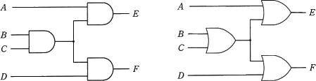
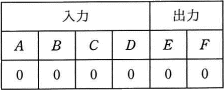
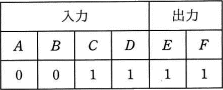
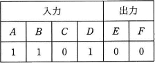
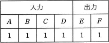
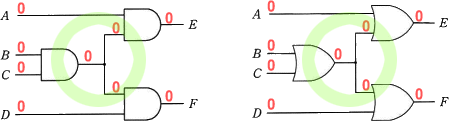
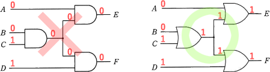
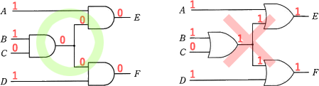
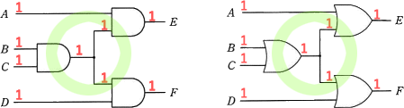

# [平成31年春期 午前 問23](https://www.ap-siken.com/kakomon/31_haru/q23.html)

#問題 #テクノロジ #ハードウェア #ハードウェア

解説を表示解説を隠す

<strong>問23</strong>　次の二つの回路の入力に値を与えたとき，表の入力A，B，C，Dと出力E，Fの組合せのうち，全ての素子が論理積素子で構成された左側の回路でだけ成立するものはどれか。 

<ul class="ap-choices">
<li class="ap-choice-item ap-wrong">

ア　

両方で成立します。

</li>
<li class="ap-choice-item ap-wrong">

イ　

右側の回路でだけ成立します。

</li>
<li class="ap-choice-item ap-correct">

ウ　

正しい。左側の回路でだけ成立します。

</li>
<li class="ap-choice-item ap-wrong">

エ　

両方で成立します。

</li>
</ul>

<h4>解説</h4>

<a href="用語/論理積" class="internal-link" data-href="用語/論理積">論理積</a>は、2つの入力がともに1のときにだけ1を出力し、そうでなければ0を出力します。<a href="用語/論理和" class="internal-link" data-href="用語/論理和">論理和</a>は、2つの入力のうち少なくとも一方が1のときに1を出力し、そうでなければ0を出力する回路です。

両方の回路にA，B，C，Dの入力を与えたときの出力E，Fを見て正しい答えを導きます。「ア」と「エ」に関しては両方で成立することが直ぐにわかると思うので、実質的には「イ」と「ウ」の比較になると思います。

両方で成立します。 

右側の回路でだけ成立します。 

正しい。左側の回路でだけ成立します。 

両方で成立します。 

