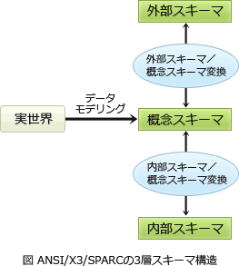

# [平成31年春期 午前 問26](https://www.ap-siken.com/kakomon/31_haru/q26.html)

#問題 #テクノロジ #データベース #データベース方式

解説を表示解説を隠す

<strong>問26</strong>　データベースを記録媒体にどのように格納するかを記述したものはどれか。

<ul class="ap-choices">
<li class="ap-choice-item ap-wrong">

ア　概念スキーマ

詳細：<a href="用語/概念スキーマ" class="internal-link" data-href="用語/概念スキーマ">概念スキーマ</a>

</li>
<li class="ap-choice-item ap-wrong">

イ　外部スキーマ

詳細：<a href="用語/外部スキーマ" class="internal-link" data-href="用語/外部スキーマ">外部スキーマ</a>

</li>
<li class="ap-choice-item ap-wrong">

ウ　サブスキーマ

<a href="用語/外部スキーマ" class="internal-link" data-href="用語/外部スキーマ">外部スキーマ</a>の別称。

</li>
<li class="ap-choice-item ap-correct">

エ　内部スキーマ

正しい。詳細：<a href="用語/内部スキーマ" class="internal-link" data-href="用語/内部スキーマ">内部スキーマ</a>

</li>
</ul>

<h4>解説</h4>

ANSI/X3/SPARCで定義されている<a href="用語/3層スキーマ構造" class="internal-link" data-href="用語/3層スキーマ構造">3層スキーマ構造</a>は、<a href="用語/概念スキーマ" class="internal-link" data-href="用語/概念スキーマ">概念スキーマ</a>、<a href="用語/外部スキーマ" class="internal-link" data-href="用語/外部スキーマ">外部スキーマ</a>、<a href="用語/内部スキーマ" class="internal-link" data-href="用語/内部スキーマ">内部スキーマ</a>の3つのグループに分けてデータ定義を行うデータベースモデルです。

<a href="用語/概念スキーマ" class="internal-link" data-href="用語/概念スキーマ">概念スキーマ</a>は、データベース化対象の業務とデータの内容を論理的な構造として記述したもの。<a href="用語/関係モデル" class="internal-link" data-href="用語/関係モデル">関係モデル</a>では、<a href="用語/E-R図" class="internal-link" data-href="用語/E-R図">E-R図</a>の作成、表定義、表の<a href="用語/正規化" class="internal-link" data-href="用語/正規化">正規化</a>が<a href="用語/概念スキーマ" class="internal-link" data-href="用語/概念スキーマ">概念スキーマ</a>に相当する。

<a href="用語/外部スキーマ" class="internal-link" data-href="用語/外部スキーマ">外部スキーマ</a>は、データの利用者からの見方を記述したもの。<a href="用語/SQL" class="internal-link" data-href="用語/SQL">SQL</a>のビューが<a href="用語/外部スキーマ" class="internal-link" data-href="用語/外部スキーマ">外部スキーマ</a>に該当する。

<a href="用語/内部スキーマ" class="internal-link" data-href="用語/内部スキーマ">内部スキーマ</a>は、データを記憶装置上にどのような形式で格納するかを記述したものです。<a href="用語/ファイル編成" class="internal-link" data-href="用語/ファイル編成">ファイル編成</a>や<a href="用語/インデックス" class="internal-link" data-href="用語/インデックス">インデックス</a>の設定などが<a href="用語/内部スキーマ" class="internal-link" data-href="用語/内部スキーマ">内部スキーマ</a>に相当する。

サブスキーマは、<a href="用語/外部スキーマ" class="internal-link" data-href="用語/外部スキーマ">外部スキーマ</a>の別称。

したがって、データベースを記録媒体にどのように格納するかを記述するのは「<a href="用語/内部スキーマ" class="internal-link" data-href="用語/内部スキーマ">内部スキーマ</a>」になります。

