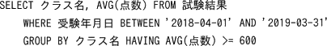
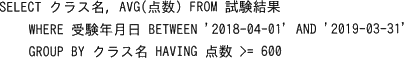
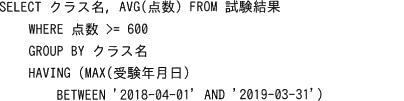

# [平成31年春期 午前 問28](https://www.ap-siken.com/kakomon/31_haru/q28.html)

#問題 #テクノロジ #データベース #データ操作

解説を表示解説を隠す

<strong>問28</strong>　過去3年分の記録を保存している"試験結果"表から，2018年度の平均点数が600点以上となったクラスのクラス名と平均点数の一覧を取得するSQL文はどれか。ここで，実線の下線は主キーを表す。  　試験結果（<u>学生番号</u>，<u>受験年月日</u>，点数，クラス名）

<ul class="ap-choices">
<li class="ap-choice-item ap-wrong">

ア　

BETWEEN句による受験年月日の絞り込みが行われておらず、全期間を対象に集計を行っているため誤りです。

</li>
<li class="ap-choice-item ap-correct">

イ　

正しい。WHERE句とBETWEEN句の組合せで受験年月日が2018年度の行だけに絞り込む。

</li>
<li class="ap-choice-item ap-wrong">

ウ　

HAVING句にはグループ化に指定されている列または集計関数しか指定できません。本肢の<a href="用語/SQL" class="internal-link" data-href="用語/SQL">SQL</a>文はグループ化されていない"点数"列を指定しているため構文エラーになります。

</li>
<li class="ap-choice-item ap-wrong">

エ　

<a href="用語/SQL" class="internal-link" data-href="用語/SQL">SQL</a>文はWHERE句→GROUP BY句の順で実行されます。「WHERE 点数 &gt;= 600」によって600点以上の行だけを選択した後にグループ化が行われるため、正しい平均点数が得られません。

</li>
</ul>

<h4>解説</h4>

正しい。この<a href="用語/SQL" class="internal-link" data-href="用語/SQL">SQL</a>文は以下の手順で処理されていきます。

<ol>
<li>WHERE句とBETWEEN句の組合せで受験年月日が2018年度の行だけに絞り込む。</li>
<li>「GROUP BY クラス名」でグループ化し、2018年度の試験結果がクラスごとにグループ化された状態にする。</li>
<li>平均点数が600点以上のグループを抽出する。グループごとの点数の平均はAVG(点数)で得られるため「HAVING AVG(点数) &gt;= 600」で、この条件に合致するグループのみを抽出する。</li>
<li>「SELECT クラス名，AVG(点数)」で、クラス名と点数の<a href="用語/平均値" class="internal-link" data-href="用語/平均値">平均値</a>を表示する。</li>
</ol>

