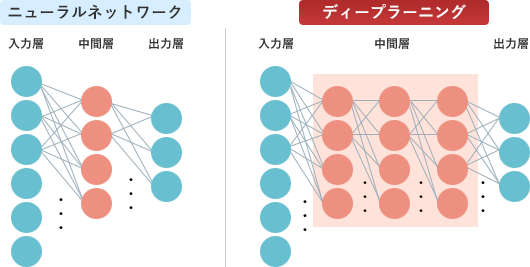

# [平成31年春期 午前 問3](https://www.ap-siken.com/kakomon/31_haru/q3.html)

#問題 #テクノロジ #基礎理論 #情報に関する理論

解説を表示解説を隠す

<strong>問3</strong>　AIにおけるディープラーニングに関する記述として，最も適切なものはどれか。

<ul class="ap-choices">
<li class="ap-choice-item ap-correct">

ア　あるデータから結果を求める処理を，人間の脳神経回路のように多層の処理を重ねることによって，複雑な判断をできるようにする。

正しい。<a href="用語/ディープラーニング" class="internal-link" data-href="用語/ディープラーニング">ディープラーニング</a>の説明です。

</li>
<li class="ap-choice-item ap-wrong">

イ　大量のデータからまだ知られていない新たな規則や仮説を発見するために，想定値から大きく外れている例外事項を取り除きながら分析を繰り返す手法である。

これは<a href="用語/データマイニング" class="internal-link" data-href="用語/データマイニング">データマイニング</a>の説明です。

</li>
<li class="ap-choice-item ap-wrong">

ウ　多様なデータや大量のデータに対して，三段論法，統計的手法やパターン認識手法を組み合わせることによって，高度なデータ分析を行う手法である。

これは<a href="用語/データマイニング" class="internal-link" data-href="用語/データマイニング">データマイニング</a>の説明です。

</li>
<li class="ap-choice-item ap-wrong">

エ　知識がルールに従って表現されており，演繹手法を利用した推論によって有意な結論を導く手法である。

これは<a href="用語/エキスパートシステム" class="internal-link" data-href="用語/エキスパートシステム">エキスパートシステム</a>の説明です。

</li>
</ul>

<h4>解説</h4>

<a href="用語/ディープラーニング" class="internal-link" data-href="用語/ディープラーニング">ディープラーニング</a>(Deep Learning)は、人間や動物の脳神経をモデル化したアルゴリズムを多層化したものを用意し、それに「十分な量のデータを与えることで、人間の力なしに自動的に特徴点やパターンを学習させる」ことをいいます。人工知能の<a href="用語/機械学習" class="internal-link" data-href="用語/機械学習">機械学習</a>分野における要素技術の1つで、深層学習とも呼ばれます。従来の<a href="用語/機械学習" class="internal-link" data-href="用語/機械学習">機械学習</a>方式と異なり、中間層の多層化によって複雑なパターンの表現と計算を可能にしていることが特徴です。

