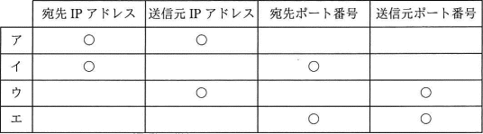
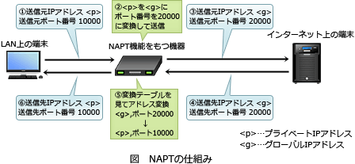

# [平成31年春期 午前 問31](https://www.ap-siken.com/kakomon/31_haru/q31.html)

#問題 #テクノロジ #ネットワーク #ネットワーク方式

解説を表示解説を隠す

<strong>問31</strong>　プライベートIPアドレスを割り当てられたPCがNAPT(IPマスカレード)機能をもつルータを経由して，インターネット上のWebサーバにアクセスしている。WebサーバからPCへの応答パケットに含まれるヘッダー情報のうち，このルータで書き換えられるフィールドの組合せとして，適切なものはどれか。ここで，表中の〇はフィールドの情報が書き換えられることを表す。 

<ul class="ap-choices">
<li class="ap-choice-item ap-wrong">

ア

<a href="用語/ヘッダー" class="internal-link" data-href="用語/ヘッダー">ヘッダー</a>フィールドの組合せが誤っています。組合せは選択肢表を参照してください。

</li>
<li class="ap-choice-item ap-correct">

イ

正しい。WebサーバからPCへの応答<a href="用語/パケット" class="internal-link" data-href="用語/パケット">パケット</a>では、<a href="用語/ルータ" class="internal-link" data-href="用語/ルータ">ルータ</a>が変換テーブルに基づき宛先<a href="用語/IPアドレス" class="internal-link" data-href="用語/IPアドレス">IPアドレス</a>と宛先<a href="用語/ポート番号" class="internal-link" data-href="用語/ポート番号">ポート番号</a>をプライベート側に書き換えます。

</li>
<li class="ap-choice-item ap-wrong">

ウ

<a href="用語/ヘッダー" class="internal-link" data-href="用語/ヘッダー">ヘッダー</a>フィールドの組合せが誤っています。組合せは選択肢表を参照してください。

</li>
<li class="ap-choice-item ap-wrong">

エ

<a href="用語/ヘッダー" class="internal-link" data-href="用語/ヘッダー">ヘッダー</a>フィールドの組合せが誤っています。組合せは選択肢表を参照してください。

</li>
</ul>

<h4>解説</h4>

<a href="用語/NAPT" class="internal-link" data-href="用語/NAPT">NAPT</a>(Network Address Port Translation)は、<a href="用語/プライベートIPアドレス" class="internal-link" data-href="用語/プライベートIPアドレス">プライベートIPアドレス</a>と<a href="用語/グローバルIPアドレス" class="internal-link" data-href="用語/グローバルIPアドレス">グローバルIPアドレス</a>を1対1で相互変換する<a href="用語/NAT" class="internal-link" data-href="用語/NAT">NAT</a>の考え方に、<a href="用語/ポート番号" class="internal-link" data-href="用語/ポート番号">ポート番号</a>でのクライアント識別を組み合わせた技術です。ホストごとにユニークな<a href="用語/ポート番号" class="internal-link" data-href="用語/ポート番号">ポート番号</a>を割り当てることで、1つの<a href="用語/グローバルIPアドレス" class="internal-link" data-href="用語/グローバルIPアドレス">グローバルIPアドレス</a>で複数の<a href="用語/プライベートIPアドレス" class="internal-link" data-href="用語/プライベートIPアドレス">プライベートIPアドレス</a>を持つノードを同時にインターネット接続させることが可能です。

<a href="用語/NAPT" class="internal-link" data-href="用語/NAPT">NAPT</a>対応機器は、クライアントの<a href="用語/プライベートIPアドレス" class="internal-link" data-href="用語/プライベートIPアドレス">プライベートIPアドレス</a>と<a href="用語/ポート番号" class="internal-link" data-href="用語/ポート番号">ポート番号</a>の組を<a href="用語/グローバルIPアドレス" class="internal-link" data-href="用語/グローバルIPアドレス">グローバルIPアドレス</a>と任意の<a href="用語/ポート番号" class="internal-link" data-href="用語/ポート番号">ポート番号</a>に変換し、変換前の情報を変換テーブルに記録しておきます。インターネットから応答が返ってきたときには、宛先<a href="用語/ポート番号" class="internal-link" data-href="用語/ポート番号">ポート番号</a>を見て変換テーブルから対応する<a href="用語/プライベートIPアドレス" class="internal-link" data-href="用語/プライベートIPアドレス">プライベートIPアドレス</a>を探し、変換前の<a href="用語/プライベートIPアドレス" class="internal-link" data-href="用語/プライベートIPアドレス">プライベートIPアドレス</a>と<a href="用語/ポート番号" class="internal-link" data-href="用語/ポート番号">ポート番号</a>に戻してクライアントに送信します。

本問は、WebサーバからPCに返される応答<a href="用語/パケット" class="internal-link" data-href="用語/パケット">パケット</a>に対して行う書換え処理が問われているので、<a href="用語/ヘッダー" class="internal-link" data-href="用語/ヘッダー">ヘッダー</a>情報のうち宛先<a href="用語/ポート番号" class="internal-link" data-href="用語/ポート番号">ポート番号</a>と宛先<a href="用語/IPアドレス" class="internal-link" data-href="用語/IPアドレス">IPアドレス</a>が<a href="用語/ルータ" class="internal-link" data-href="用語/ルータ">ルータ</a>経由時に置き換えられることになります。したがって「イ」の組合せが正解です。

