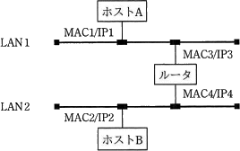
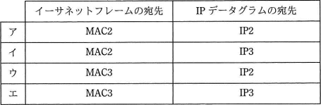
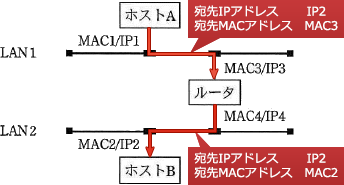

# [平成31年春期 午前 問33](https://www.ap-siken.com/kakomon/31_haru/q33.html)

#問題 #テクノロジ #ネットワーク #データ通信と制御

解説を表示解説を隠す

<strong>問33</strong>　図のようなIPネットワークのLAN環境で，ホストAからホストBにパケットを送信する。LAN1において，パケット内のイーサネットフレームの宛先とIPデータグラムの宛先の組合せとして，適切なものはどれか。ここで，図中の MACn/IPm はホスト又はルータがもつインタフェースのMACアドレスとIPアドレスを示す。  

<ul class="ap-choices">
<li class="ap-choice-item ap-wrong">

ア

宛先MACがホストB側のMAC2になっており誤りです。LAN1では次ホップの<a href="用語/ルータ" class="internal-link" data-href="用語/ルータ">ルータ</a>のMAC3が必要です。

</li>
<li class="ap-choice-item ap-wrong">

イ

宛先MACがMAC2、宛先IPが<a href="用語/ルータ" class="internal-link" data-href="用語/ルータ">ルータ</a>のIP3となっており、ともに誤りです。

</li>
<li class="ap-choice-item ap-correct">

ウ

正しい。LAN1内の宛先は、イーサネットフレームがMAC3、IPデータグラムがIP2です。

</li>
<li class="ap-choice-item ap-wrong">

エ

宛先IPが<a href="用語/ルータ" class="internal-link" data-href="用語/ルータ">ルータ</a>のIP3になっており誤りです。IPはエンドトゥエンドでホストBのIP2を指定します。

</li>
</ul>

<h4>解説</h4>

まずIP<a href="用語/パケット" class="internal-link" data-href="用語/パケット">パケット</a>とイーサネットフレームの違いについて確認しておきます。

<dl>
<dt>IP<a href="用語/パケット" class="internal-link" data-href="用語/パケット">パケット</a></dt>
<dd><a href="用語/IPアドレス" class="internal-link" data-href="用語/IPアドレス">IPアドレス</a>によって<a href="用語/ネットワーク層" class="internal-link" data-href="用語/ネットワーク層">ネットワーク層</a>の通信を行うIP<a href="用語/ヘッダー" class="internal-link" data-href="用語/ヘッダー">ヘッダー</a>を付加した<a href="用語/パケット" class="internal-link" data-href="用語/パケット">パケット</a></dd>
<dt>イーサネットフレーム(MACフレーム)</dt>
<dd>MACアドレスによって<a href="用語/データリンク層" class="internal-link" data-href="用語/データリンク層">データリンク層</a>の通信を行うために、IP<a href="用語/パケット" class="internal-link" data-href="用語/パケット">パケット</a>にMAC<a href="用語/ヘッダー" class="internal-link" data-href="用語/ヘッダー">ヘッダー</a>を付加した<a href="用語/パケット" class="internal-link" data-href="用語/パケット">パケット</a></dd>
</dl>

ホストBは、ホストAから見て<a href="用語/ルータ" class="internal-link" data-href="用語/ルータ">ルータ</a>の外側(異なる<a href="用語/ブロードキャスト" class="internal-link" data-href="用語/ブロードキャスト">ブロードキャスト</a>ドメイン)に属するので、直接通信ができません。そこでホストAは、<a href="用語/ルータ" class="internal-link" data-href="用語/ルータ">ルータ</a>を経由してホストBに<a href="用語/パケット" class="internal-link" data-href="用語/パケット">パケット</a>を届けることになります。

<a href="用語/IPアドレス" class="internal-link" data-href="用語/IPアドレス">IPアドレス</a>は通信する端末間でエンドトゥエンドなので、ホストAが送信するIPデータグラムの宛先<a href="用語/IPアドレス" class="internal-link" data-href="用語/IPアドレス">IPアドレス</a>にはホストBの IP2 を指定します。<a href="用語/ルータ" class="internal-link" data-href="用語/ルータ">ルータ</a>とホストAは、同じ<a href="用語/ブロードキャスト" class="internal-link" data-href="用語/ブロードキャスト">ブロードキャスト</a>ドメインに属するので、ホストAは<a href="用語/ARP" class="internal-link" data-href="用語/ARP">ARP</a>で<a href="用語/ルータ" class="internal-link" data-href="用語/ルータ">ルータ</a>のMACアドレスを取得して、MAC3 を宛先MACアドレスに指定します。

IP<a href="用語/パケット" class="internal-link" data-href="用語/パケット">パケット</a>を受け取った<a href="用語/ルータ" class="internal-link" data-href="用語/ルータ">ルータ</a>は、宛先<a href="用語/IPアドレス" class="internal-link" data-href="用語/IPアドレス">IPアドレス</a>を見てホストBが自身に直接接続されているネットワークに属していると判断します。<a href="用語/ルータ" class="internal-link" data-href="用語/ルータ">ルータ</a>は、<a href="用語/ARP" class="internal-link" data-href="用語/ARP">ARP</a>によってホストBのMACアドレスを取得し、宛先MACアドレスをMAC2に書き換えて、LAN2側のポートからイーサネットフレームを送出します。

したがって、LAN1内における<a href="用語/パケット" class="internal-link" data-href="用語/パケット">パケット</a>の宛先は<a href="用語/IPアドレス" class="internal-link" data-href="用語/IPアドレス">IPアドレス</a>「IP2」、MACアドレス「MAC3」に設定されています。

