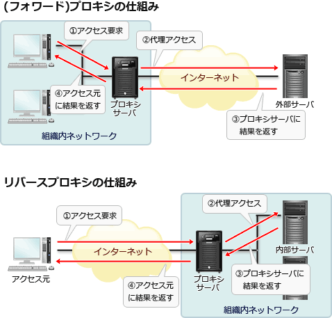

# [平成31年春期 午前 問35](https://www.ap-siken.com/kakomon/31_haru/q35.html)

#問題 #テクノロジ #ネットワーク #データ通信と制御

解説を表示解説を隠す

<strong>問35</strong>　Webサーバを使ったシステムにおいて，インターネット経由でアクセスしてくるクライアントから受け取ったリクエストをWebサーバに中継する仕組みはどれか。

<ul class="ap-choices">
<li class="ap-choice-item ap-wrong">

ア　DMZ

詳細：<a href="用語/DMZ" class="internal-link" data-href="用語/DMZ">DMZ</a>

</li>
<li class="ap-choice-item ap-wrong">

イ　フォワードプロキシ

<a href="用語/クライアント" class="internal-link" data-href="用語/クライアント">クライアント</a>側に位置し、<a href="用語/クライアント" class="internal-link" data-href="用語/クライアント">クライアント</a>に代わって<a href="用語/Webサーバ" class="internal-link" data-href="用語/Webサーバ">Webサーバ</a>にアクセスする仕組みであり、本問のサーバ側中継ではない。

</li>
<li class="ap-choice-item ap-wrong">

ウ　プロキシARP

あるホスト宛ての<a href="用語/ARP" class="internal-link" data-href="用語/ARP">ARP</a>要求に対して代理で<a href="用語/ARP" class="internal-link" data-href="用語/ARP">ARP</a>応答をする機能であり、Webリクエストの中継ではない。

</li>
<li class="ap-choice-item ap-correct">

エ　リバースプロキシ

正しい。詳細：<a href="用語/リバースプロキシ" class="internal-link" data-href="用語/リバースプロキシ">リバースプロキシ</a>

</li>
</ul>

<h4>解説</h4>

<a href="用語/リバースプロキシ" class="internal-link" data-href="用語/リバースプロキシ">リバースプロキシ</a>は、<a href="用語/クライアント" class="internal-link" data-href="用語/クライアント">クライアント</a>と<a href="用語/Webサーバ" class="internal-link" data-href="用語/Webサーバ">Webサーバ</a>の間の<a href="用語/Webサーバ" class="internal-link" data-href="用語/Webサーバ">Webサーバ</a>側に位置し、<a href="用語/Webサーバ" class="internal-link" data-href="用語/Webサーバ">Webサーバ</a>を代理する形で<a href="用語/クライアント" class="internal-link" data-href="用語/クライアント">クライアント</a>からのリクエストを受け取り、そのリクエストを<a href="用語/Webサーバ" class="internal-link" data-href="用語/Webサーバ">Webサーバ</a>に受け渡す仕組みです。

<a href="用語/クライアント" class="internal-link" data-href="用語/クライアント">クライアント</a>からのリクエストは必ず<a href="用語/リバースプロキシ" class="internal-link" data-href="用語/リバースプロキシ">リバースプロキシ</a>を経由するので、<a href="用語/リバースプロキシ" class="internal-link" data-href="用語/リバースプロキシ">リバースプロキシ</a>に<a href="用語/アクセス制御" class="internal-link" data-href="用語/アクセス制御">アクセス制御</a>や<a href="用語/認証" class="internal-link" data-href="用語/認証">認証</a>などの機能をもたせることで、<a href="用語/Webサーバ" class="internal-link" data-href="用語/Webサーバ">Webサーバ</a>のセキュリティ向上が期待できます。

