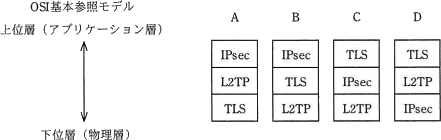
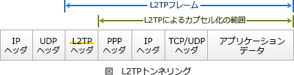

# [平成31年春期 午前 問42](https://www.ap-siken.com/kakomon/31_haru/q42.html)

#問題 #テクノロジ #セキュリティ #セキュリティ実装技術

解説を表示解説を隠す

<strong>問42</strong>　VPNで使用されるセキュアなプロトコルであるIPsec，L2TP，TLSの，OSI基本参照モデルにおける相対的な位置関係はどれか。 

<ul class="ap-choices">
<li class="ap-choice-item ap-wrong">

ア　A

<a href="用語/IPsec" class="internal-link" data-href="用語/IPsec">IPsec</a>→L2TP→TLS の順になっており、各プロトコルの階層と一致しない。

</li>
<li class="ap-choice-item ap-wrong">

イ　B

<a href="用語/IPsec" class="internal-link" data-href="用語/IPsec">IPsec</a>→TLS→L2TP の順になっており、TLSが<a href="用語/IPsec" class="internal-link" data-href="用語/IPsec">IPsec</a>より下層になっている。

</li>
<li class="ap-choice-item ap-correct">

ウ　C

正しい。上層から TLS→<a href="用語/IPsec" class="internal-link" data-href="用語/IPsec">IPsec</a>→L2TP の順である。

</li>
<li class="ap-choice-item ap-wrong">

エ　D

TLS→L2TP→<a href="用語/IPsec" class="internal-link" data-href="用語/IPsec">IPsec</a> の順になっており、L2TPと<a href="用語/IPsec" class="internal-link" data-href="用語/IPsec">IPsec</a>の上下が逆である。

</li>
</ul>

<h4>解説</h4>

それぞれのセキュアプロトコルの特徴と位置する階層は次のとおりです。

<a href="用語/IPsec" class="internal-link" data-href="用語/IPsec">IPsec</a>（IP Security）IP(Internet Protocol)を拡張してセキュリティを高めたプロトコルで、<a href="用語/改ざん" class="internal-link" data-href="用語/改ざん">改ざん</a>の検知、通信データの暗号化および送信元の<a href="用語/認証" class="internal-link" data-href="用語/認証">認証</a>などの機能を、<a href="用語/OSI基本参照モデル" class="internal-link" data-href="用語/OSI基本参照モデル">OSI基本参照モデル</a>の<a href="用語/ネットワーク層" class="internal-link" data-href="用語/ネットワーク層">ネットワーク層</a>レベル(<a href="用語/TCP/IP" class="internal-link" data-href="用語/TCP/IP">TCP/IP</a>モデルではIP層)で提供する。<a href="用語/認証" class="internal-link" data-href="用語/認証">認証</a>プロトコルAHや<a href="用語/認証" class="internal-link" data-href="用語/認証">認証</a>／暗号化プロトコルESPを含む

L2TP（Layer 2 Tunneling Protocol）<a href="用語/PPP" class="internal-link" data-href="用語/PPP">PPP</a>などのフレームをIPヘッダーで<a href="用語/カプセル化" class="internal-link" data-href="用語/カプセル化">カプセル化</a>することで、<a href="用語/ルータ" class="internal-link" data-href="用語/ルータ">ルータ</a>を越えた複数の拠点間でフレームのやり取りを実現する<a href="用語/トンネリング" class="internal-link" data-href="用語/トンネリング">トンネリング</a>プロトコル。暗号化の機能はないため必要に応じて<a href="用語/IPsec" class="internal-link" data-href="用語/IPsec">IPsec</a>と併用する必要がある。"レイヤー2"の名称どおり、<a href="用語/OSI基本参照モデル" class="internal-link" data-href="用語/OSI基本参照モデル">OSI基本参照モデル</a>の第2層の<a href="用語/データリンク層" class="internal-link" data-href="用語/データリンク層">データリンク層</a>で動作する

TLS（Transport Layer Security）通信の暗号化、<a href="用語/デジタル証明書" class="internal-link" data-href="用語/デジタル証明書">デジタル証明書</a>を利用した<a href="用語/改ざん" class="internal-link" data-href="用語/改ざん">改ざん</a>検知、ノード<a href="用語/認証" class="internal-link" data-href="用語/認証">認証</a>を含む統合セキュアプロトコル。その名のとおり<a href="用語/OSI基本参照モデル" class="internal-link" data-href="用語/OSI基本参照モデル">OSI基本参照モデル</a>の<a href="用語/トランスポート層" class="internal-link" data-href="用語/トランスポート層">トランスポート層</a>で動作する

<a href="用語/IPsec" class="internal-link" data-href="用語/IPsec">IPsec</a>はIPが属する<a href="用語/ネットワーク層" class="internal-link" data-href="用語/ネットワーク層">ネットワーク層</a>(第3層)、L2TPは<a href="用語/データリンク層" class="internal-link" data-href="用語/データリンク層">データリンク層</a>(第2層)、TLSは<a href="用語/トランスポート層" class="internal-link" data-href="用語/トランスポート層">トランスポート層</a>(第4層)に位置するので、適切な位置関係は上層から TLS→<a href="用語/IPsec" class="internal-link" data-href="用語/IPsec">IPsec</a>→L2TP の順です。したがって「C」が正解です。

