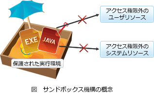

# [平成31年春期 午前 問43](https://www.ap-siken.com/kakomon/31_haru/q43.html)

#問題 #テクノロジ #セキュリティ #セキュリティ実装技術

解説を表示解説を隠す

<strong>問43</strong>　情報セキュリティにおけるサンドボックスの説明はどれか。

<ul class="ap-choices">
<li class="ap-choice-item ap-wrong">

ア　OS，DBMS，アプリケーションソフトウェア，ネットワーク機器など多様なソフトウェアや機器が出力する大量のログデータを分析する。

これは<a href="用語/SIEM" class="internal-link" data-href="用語/SIEM">SIEM</a>の説明です。

</li>
<li class="ap-choice-item ap-wrong">

イ　Webアプリケーションの入力フォームへの入力データに含まれるHTMLタグ，JavaScript，SQL文などを他の文字列に置き換えることによって，入力データ中に含まれる悪意のあるプログラムの実行を防ぐ。

サニタイジングやエスケープ処理の説明です。

</li>
<li class="ap-choice-item ap-wrong">

ウ　Webサーバの前段に設置し，不特定多数のPCから特定のWebサーバへのリクエストに代理応答する。

これは<a href="用語/リバースプロキシ" class="internal-link" data-href="用語/リバースプロキシ">リバースプロキシ</a>の説明です。

</li>
<li class="ap-choice-item ap-correct">

エ　不正な動作の可能性があるプログラムを特別な領域で動作させることによって，他の領域に悪影響が及ぶのを防ぐ。

正しい。<a href="用語/サンドボックス" class="internal-link" data-href="用語/サンドボックス">サンドボックス</a>の説明です。

</li>
</ul>

<h4>解説</h4>

<a href="用語/サンドボックス" class="internal-link" data-href="用語/サンドボックス">サンドボックス</a>(Sandbox)は、外部から受け取ったプログラムを保護された領域で動作させることによってシステムが不正に操作されるのを防ぎ、セキュリティを向上させる仕組みです。

JavaアプレットやAdobeFlash、<a href="用語/Webブラウザ" class="internal-link" data-href="用語/Webブラウザ">Webブラウザ</a>のプラグインなどでは外部プログラムの機能を制限することで<a href="用語/脆弱性" class="internal-link" data-href="用語/脆弱性">脆弱性</a>を低減させています。最近では、<a href="用語/仮想環境" class="internal-link" data-href="用語/仮想環境">仮想環境</a>として構築した<a href="用語/サンドボックス" class="internal-link" data-href="用語/サンドボックス">サンドボックス</a>が、未確認ファイルや不審ファイルの動作確認に使えることから<a href="用語/標的型攻撃" class="internal-link" data-href="用語/標的型攻撃">標的型攻撃</a>への対策としても注目を集めています。<a href="用語/サンドボックス" class="internal-link" data-href="用語/サンドボックス">サンドボックス</a>とは「砂場」のことであり、子供を安全が確保された場所内だけで遊ばせるイメージからこう呼ばれています。

したがって適切な記述は「エ」です。

