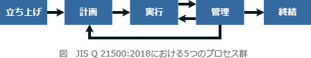
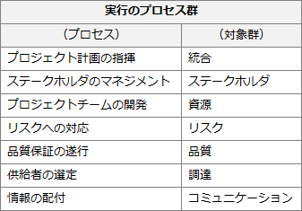

# [平成31年春期 午前 問51](https://www.ap-siken.com/kakomon/31_haru/q51.html)

#問題 #マネジメント #プロジェクトマネジメント #プロジェクトマネジメント

解説を表示解説を隠す

<strong>問51</strong>　JIS Q 21500:2018(プロジェクトマネジメントの手引)によれば，プロジェクトマネジメントの"実行のプロセス群"の説明はどれか。

<ul class="ap-choices">
<li class="ap-choice-item ap-wrong">

ア　プロジェクトの計画に照らしてプロジェクトパフォーマンスを監視し，測定し，管理するために使用する。

これは<a href="用語/管理のプロセス群" class="internal-link" data-href="用語/管理のプロセス群">管理のプロセス群</a>の説明です

</li>
<li class="ap-choice-item ap-wrong">

イ　プロジェクトフェーズ又はプロジェクトが完了したことを正式に確定するために使用し，必要に応じて考慮し，実行するように得た教訓を提供するために使用する。

これは<a href="用語/終結のプロセス群" class="internal-link" data-href="用語/終結のプロセス群">終結のプロセス群</a>の説明です

</li>
<li class="ap-choice-item ap-wrong">

ウ　プロジェクトフェーズ又はプロジェクトを開始するために使用し，プロジェクトフェーズ又はプロジェクトの目標を定義し，プロジェクトマネージャがプロジェクト作業を進める許可を得るために使用する。

これは<a href="用語/立ち上げのプロセス群" class="internal-link" data-href="用語/立ち上げのプロセス群">立ち上げのプロセス群</a>の説明です

</li>
<li class="ap-choice-item ap-correct">

エ　プロジェクトマネジメントの活動を遂行し，プロジェクトの全体計画に従ってプロジェクトの成果物の提示を支援するために使用する。

正しい。詳細：<a href="用語/実行のプロセス群" class="internal-link" data-href="用語/実行のプロセス群">実行のプロセス群</a>

</li>
</ul>

<h4>解説</h4>

<a href="用語/プロジェクトマネジメント" class="internal-link" data-href="用語/プロジェクトマネジメント">プロジェクトマネジメント</a>のプロセス群には、立ち上げ、計画、実行、管理、終結の5つがあります。

このうち"<a href="用語/実行のプロセス群" class="internal-link" data-href="用語/実行のプロセス群">実行のプロセス群</a>"は、<a href="用語/プロジェクトマネジメント" class="internal-link" data-href="用語/プロジェクトマネジメント">プロジェクトマネジメント</a>の活動を遂行し，プロジェクトの全体計画に従ってプロジェクトの成果物の提示を支援するためのプロセスの集合です。具体的には、以下のプロセスが含まれます。

