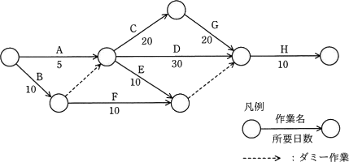

# [平成31年春期 午前 問53](https://www.ap-siken.com/kakomon/31_haru/q53.html)

#問題 #マネジメント #プロジェクトマネジメント #プロジェクトの時間

解説を表示解説を隠す

<strong>問53</strong>　図のアローダイアグラムから読み取れることとして，適切なものはどれか。ここで，プロジェクトの開始日を1日目とする。 

<ul class="ap-choices">
<li class="ap-choice-item ap-wrong">

ア　作業Cを最も早く開始できるのは6日目である。

作業Cの先行作業は作業Aと作業Bです。作業Bが完了するのに10日を要するので、作業Cを最も早く開始できるのは11日目になります。

</li>
<li class="ap-choice-item ap-wrong">

イ　作業Dはクリティカルパス上の作業である。

<a href="用語/クリティカルパス" class="internal-link" data-href="用語/クリティカルパス">クリティカルパス</a>上の作業は、B・C・G・Hの4つです。作業Dは<a href="用語/クリティカルパス" class="internal-link" data-href="用語/クリティカルパス">クリティカルパス</a>上の作業でありません。

</li>
<li class="ap-choice-item ap-correct">

ウ　作業Eの総余裕日数は30日である。

正しい。作業Eの最早開始日は11日目、最遅開始日は41日目で、余裕日数は41－11＝30日です。

</li>
<li class="ap-choice-item ap-wrong">

エ　作業Fを最も遅く開始できるのは11日目である。

作業Fを最も遅く開始できるのは41日目になります（最遅開始日）。記述にある11日目は作業Fの最早開始日です。

</li>
</ul>

<h4>解説</h4>

まず、<a href="用語/アローダイアグラム" class="internal-link" data-href="用語/アローダイアグラム">アローダイアグラム</a>上の全ての経路を検証して、<a href="用語/クリティカルパス" class="internal-link" data-href="用語/クリティカルパス">クリティカルパス</a>とプロジェクト全体の最短所要日数を求めておきましょう。※ダミー作業は作業日数0日として計算します。

A→C→G→H：5＋20＋20＋10＝55日 A→D→H：5＋30＋10＝45日 A→E→(右のダミー)→H：5＋10＋0＋10＝25日 B→(左のダミー)→C→G→H：10＋0＋20＋20＋10＝60日 B→(左のダミー)→D→H：10＋0＋30＋10＝50日 B→(左のダミー)→E→(右のダミー)→H：10＋0＋10＋0＋10＝30日 B→F→(右のダミー)→H：10＋10＋0＋10＝30日

よって、<a href="用語/クリティカルパス" class="internal-link" data-href="用語/クリティカルパス">クリティカルパス</a>は「B→(左のダミー)→C→G→H」、最短完了日数は「60日」です。

ア：作業Cの先行作業は作業Aと作業Bです。作業Bが完了するのに10日を要するので、作業Cを最も早く開始できるのは11日目になります。

イ：<a href="用語/クリティカルパス" class="internal-link" data-href="用語/クリティカルパス">クリティカルパス</a>上の作業は、B・C・G・Hの4つです。作業Dは<a href="用語/クリティカルパス" class="internal-link" data-href="用語/クリティカルパス">クリティカルパス</a>上の作業でありません。

ウ：正しい。最短で完了するのは開始日から数えて60日目なので、完了前に行われる作業H(10日)は、少なくとも51日目までには作業を開始しなくてはなりません。作業Hの開始条件には作業Eの完了も含まれるので、作業Eは50日目までに完了していれば<a href="用語/クリティカルパス" class="internal-link" data-href="用語/クリティカルパス">クリティカルパス</a>に影響を与えないことがわかります。作業Eを最も早く開始できるのはA(5日)とB(10日)の両方が完了する日の翌日(11日目)、<a href="用語/クリティカルパス" class="internal-link" data-href="用語/クリティカルパス">クリティカルパス</a>に影響を与えず作業Eを最も遅く開始できるのは「51日目－E(10日)＝41日目」です。余裕日数はこの両方の差なので「41－11＝30日」となります。

エ：「ウ」の作業Eと同様の考え方で、作業Fを最も遅く開始できるのは41日目になります（最遅開始日）。記述にある11日目は作業Fの最早開始日です。

