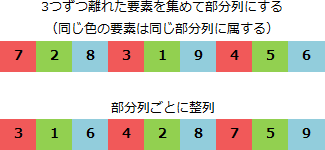

# [平成31年春期 午前 問6](https://www.ap-siken.com/kakomon/31_haru/q6.html)

#問題 #テクノロジ #アルゴリズムとプログラミング #アルゴリズム

解説を表示解説を隠す

<strong>問6</strong>　次の手順はシェルソートによる整列を示している。データ列 7，2，8，3，1，9，4，5，6 を手順(1)～(4)に従って整列するとき，手順(3)を何回繰り返して完了するか。ここで，[ ]は小数点以下を切り捨てた結果を表す。  〔手順〕 (1) "H←[データ数÷3]"とする。 (2) データ列を，互いにH要素分だけ離れた要素の集まりからなる部分列とし，それぞれの部分列を，挿入法を用いて整列する。 (3) "H←[H÷3]"とする。 (4) Hが0であればデータ列の整列は完了し，0でなければ(2)に戻る。

<ul class="ap-choices">
<li class="ap-choice-item ap-correct">

ア　2

正しい。<a href="用語/シェルソート" class="internal-link" data-href="用語/シェルソート">シェルソート</a>の間隔Hの更新（手順3）は H=3→1、H=1→0 の2回で完了する。

</li>
<li class="ap-choice-item ap-wrong">

イ　3

手順(3)の実行回数を数え過ぎている。H=0 になった時点で完了し、その回も数えると2回である。

</li>
<li class="ap-choice-item ap-wrong">

ウ　4

部分列の整列回数などと混同した値。手順(3)は2回で完了する。

</li>
<li class="ap-choice-item ap-wrong">

エ　5

部分列の整列回数などと混同した値。手順(3)は2回で完了する。

</li>
</ul>

<h4>解説</h4>

9つの要素を手順に沿って整列していくと、次のようになります。

<ol>
<li>H ← 9÷3 //H=3</li>
<li>Hが3なので、要素ごとが互いに3つずつ離れた要素から成る3つの部分文字列に分解し、それぞれ整列する。 </li>
<li>H ← 3÷3 //H=1、(3)の処理1回目</li>
<li>Hが0ではないので、(2)の処理に戻る</li>
<li>Hが1なので、要素ごとが互いに1つずつ離れた要素から成る 3,1,6,4,2,8,7,5,9 を整列し、1,2,3,4,5,6,7,8,9 とする。</li>
<li>H ← 1÷3 //H=0、(3)の処理2回目</li>
<li>Hが0なので、データ列の整列が完了</li>
</ol>

したがって完了までに(3)の処理が繰り返される回数は2回です。

