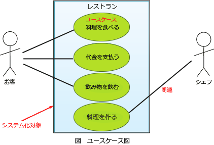

# [平成31年春期 午前 問65](https://www.ap-siken.com/kakomon/31_haru/q65.html)

#問題 #ストラテジ #システム企画 #要件定義

解説を表示解説を隠す

<strong>問65</strong>　要件定義において，利用者や外部システムと，業務の機能を分離して表現することによって，利用者を含めた業務全体の範囲を明らかにするために使用される図はどれか。

<ul class="ap-choices">
<li class="ap-choice-item ap-wrong">

ア　アクティビティ図

<a href="用語/アクティビティ図" class="internal-link" data-href="用語/アクティビティ図">アクティビティ図</a>は、上流行程のビジネスプロセスの流れや下流行程のプログラムの制御フローなどシステムの流れを表せる<a href="用語/フローチャート" class="internal-link" data-href="用語/フローチャート">フローチャート</a>の<a href="用語/UML" class="internal-link" data-href="用語/UML">UML</a>版です。

</li>
<li class="ap-choice-item ap-wrong">

イ　オブジェクト図

<a href="用語/オブジェクト図" class="internal-link" data-href="用語/オブジェクト図">オブジェクト図</a>は、ある特定の時点でのオブジェクトのインスタンス間の静的な構造を記述する図です。

</li>
<li class="ap-choice-item ap-wrong">

ウ　クラス図

<a href="用語/クラス図" class="internal-link" data-href="用語/クラス図">クラス図</a>は、クラス、属性、クラス間の関係からシステムの構造を記述する静的な構造図です。

</li>
<li class="ap-choice-item ap-correct">

エ　ユースケース図

正しい。詳細：<a href="用語/ユースケース図" class="internal-link" data-href="用語/ユースケース図">ユースケース図</a>

</li>
</ul>

<h4>解説</h4>

<a href="用語/ユースケース図" class="internal-link" data-href="用語/ユースケース図">ユースケース図</a>は、<a href="用語/UML" class="internal-link" data-href="用語/UML">UML</a>の中でもシステムの振る舞いを表現する図で、システムに要求される機能を、ユーザーの視点から示した図です。<a href="用語/ユースケース図" class="internal-link" data-href="用語/ユースケース図">ユースケース図</a>を有効に活用することにより、システムの全体像を開発者とユーザーが一緒に評価しやすくなる利点があります。

