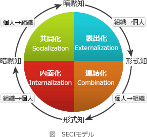

# [平成31年春期 午前 問69](https://www.ap-siken.com/kakomon/31_haru/q69.html)

#問題 #ストラテジ #経営戦略マネジメント #経営管理システム

解説を表示解説を隠す

<strong>問69</strong>　知識創造プロセス(SECIモデル)における"表出化"はどれか。

<ul class="ap-choices">
<li class="ap-choice-item ap-wrong">

ア　暗黙知から新たに暗黙知を得ること

これは共同化の説明です。

</li>
<li class="ap-choice-item ap-correct">

イ　暗黙知から新たに形式知を得ること

正しい。表出化の説明です。

</li>
<li class="ap-choice-item ap-wrong">

ウ　形式知から新たに暗黙知を得ること

これは内面化の説明です。

</li>
<li class="ap-choice-item ap-wrong">

エ　形式知から新たに形式知を得ること

これは連結化の説明です。

</li>
</ul>

<h4>解説</h4>

<a href="用語/SECIモデル" class="internal-link" data-href="用語/SECIモデル">SECIモデル</a>(知識創造プロセス)は、知識には"暗黙知"と"形式知"があり、それが個人・組織の相互間で絶えず変換・移転されることによって新たな知識が生まれる考え方をもとに、"暗黙知"と"形式知"の交換と移転のプロセスを示したものです。"暗黙知"とは、組織のメンバー個人の経験・知識・スキルなど言語化されていない主観的な知識、"形式知"とは、マニュアル、データなどを用いて客観的に言語され、組織メンバー全体が理解・利用できるよう形を変えた知識です。

新たな知識創造へのプロセスは以下に示す4つの段階から構成されます。

<dl>
<dt>共同化</dt>
<dd>個人同士が直接的な相互作用により暗黙知を共有する。個人の暗黙知が、グループの暗黙知に変換される</dd>
<dt>表出化</dt>
<dd>共同化によって得られた個人の暗黙知をチームレベルで積み上げ、統合していく。この過程で暗黙知が概念化され、言葉やイメージなどを用いて形式知に変換される。グループの暗黙知が、グループの形式知に変換される</dd>
<dt>連結化</dt>
<dd>形式知が組織の内外から集められ、それらを組み合わせ整理し、複合的で体系的な形式知が組織レベルで築かれる。グループの形式知が、組織レベルの形式知に変換される</dd>
<dt>内面化</dt>
<dd>連結化によってより整理された形式知が実行される。この形式知を用いて個人が行動することにより形式知に個人の経験が付随され、さらに厚みを増した暗黙知が得られる。組織レベルの形式知が、個人の暗黙知に変換される</dd>
</dl>

このモデルにおける"表出化"は、個人レベルの暗黙知から新たに形式知を得ることをいいます。したがって「イ」が適切です。

