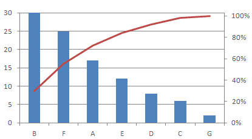

# [平成31年春期 午前 問74](https://www.ap-siken.com/kakomon/31_haru/q74.html)

#問題 #ストラテジ #企業活動 #業務分析・データ利活用

解説を表示解説を隠す

<strong>問74</strong>　発生した故障について，発生要因ごとの件数の記録を基に，故障発生件数で上位を占める主な要因を明確に表現するのに適している図法はどれか。

<ul class="ap-choices">
<li class="ap-choice-item ap-wrong">

ア　特性要因図

これは<a href="用語/特性要因図" class="internal-link" data-href="用語/特性要因図">特性要因図</a>の説明です。

</li>
<li class="ap-choice-item ap-correct">

イ　パレート図

正しい。詳細：<a href="用語/パレート図" class="internal-link" data-href="用語/パレート図">パレート図</a>

</li>
<li class="ap-choice-item ap-wrong">

ウ　マトリックス図

これは<a href="用語/マトリックス図法" class="internal-link" data-href="用語/マトリックス図法">マトリックス図法</a>の説明です。

</li>
<li class="ap-choice-item ap-wrong">

エ　連関図

これは<a href="用語/連関図法" class="internal-link" data-href="用語/連関図法">連関図法</a>の説明です。

</li>
</ul>

<h4>解説</h4>

<a href="用語/特性要因図" class="internal-link" data-href="用語/特性要因図">特性要因図</a>は、現れた特性（結果）とそれに影響を及ぼしたと思われる要因の関係を体系的に表わした図です。多くの要因が複雑に絡みあっているときに、直接的な原因と間接的な原因に分別したり、真の問題点を明らかにしたりすることができます。

<a href="用語/パレート図" class="internal-link" data-href="用語/パレート図">パレート図</a>は、分析対象の項目値を大きい順に並べた棒グラフと、累積構成比を表す折れ線グラフを組み合わせた複合グラフで、主に複数の分析対象の中から重要である要素を識別するために使用します。棒グラフが項目値の大小を基準に並ぶので、上位を占める要因が一目瞭然です。

<a href="用語/マトリックス図法" class="internal-link" data-href="用語/マトリックス図法">マトリックス図</a>は、表の縦軸と横軸にいくつかの項目を設定し、交点に各項目同士の関連性・関連度合いなどを文字列や数値または記号などで表した分析図です。

<a href="用語/連関図法" class="internal-link" data-href="用語/連関図法">連関図</a>は、複雑な要因の絡み合う事象について、その事象間の因果関係・相互関係を明らかにして問題や原因を特定し、目的達成のための手段を発見する手法です。

したがって「イ」が正解です。

