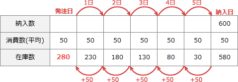

# [平成31年春期 午前 問75](https://www.ap-siken.com/kakomon/31_haru/q75.html)

#問題 #ストラテジ #企業活動 #業務分析・データ利活用

解説を表示解説を隠す

<strong>問75</strong>　定量発注方式における経済的発注量を計算したところ，600個であった。発注から納入までの調達期間は5日であり，安全在庫量が30個である場合，この購買品目の発注点は何個か。ここで，1日の平均消費量は50個であるとする。

<ul class="ap-choices">
<li class="ap-choice-item ap-wrong">

ア　220

調達期間中の消費量(250)から<a href="用語/安全在庫" class="internal-link" data-href="用語/安全在庫">安全在庫</a>を差し引いた誤計算。

</li>
<li class="ap-choice-item ap-wrong">

イ　250

調達期間中の消費量(50×5=250)だけで、<a href="用語/安全在庫" class="internal-link" data-href="用語/安全在庫">安全在庫</a>を加算していない。

</li>
<li class="ap-choice-item ap-correct">

ウ　280

正しい。調達期間中の消費量250個に<a href="用語/安全在庫" class="internal-link" data-href="用語/安全在庫">安全在庫</a>30個を加えた280個が<a href="用語/発注点" class="internal-link" data-href="用語/発注点">発注点</a>。

</li>
<li class="ap-choice-item ap-wrong">

エ　300

経済的発注量600個や別の日数を混ぜた誤計算。本問の<a href="用語/発注点" class="internal-link" data-href="用語/発注点">発注点</a>には経済的発注量は使わない。

</li>
</ul>

<h4>解説</h4>

定量発注方式とは、発注時期をあらかじめ決めずに、在庫が基準数を下回った時点で最適発注量(経済的発注量)ずつを発注する方式です。定量発注方式における適切な<a href="用語/発注点" class="internal-link" data-href="用語/発注点">発注点</a>とは、常時保管している在庫数をできるだけ少なくし、かつ、<a href="用語/安全在庫" class="internal-link" data-href="用語/安全在庫">安全在庫</a>を下回らないような時点のことです。

保管在庫を最も少なくするためには、納入日の前日終業後に<a href="用語/安全在庫" class="internal-link" data-href="用語/安全在庫">安全在庫</a>である30個が最低限残っていればよいため、それと発注から納入までの5日間に消費する(50×5=)250個を足した280個が<a href="用語/発注点" class="internal-link" data-href="用語/発注点">発注点</a>になります。

