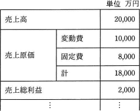

# [平成31年春期 午前 問76](https://www.ap-siken.com/kakomon/31_haru/q76.html)

#問題 #ストラテジ #企業活動 #会計・財務

解説を表示解説を隠す

<strong>問76</strong>　表の事業計画案に対して，新規設備投資に伴う減価償却費(固定費)の増加1,000万円を織り込み，かつ，売上総利益を3,000万円とするようにしたい。変動費率に変化がないとすると，売上高の増加を何万円にすればよいか。 

<ul class="ap-choices">
<li class="ap-choice-item ap-wrong">

ア　2,000

必要売上高と計画案売上高の差から求まる増加額ではありません。

</li>
<li class="ap-choice-item ap-wrong">

イ　3,000

必要売上高と計画案売上高の差から求まる増加額ではありません。

</li>
<li class="ap-choice-item ap-correct">

ウ　4,000

正しい。必要売上高24,000万円から計画案の20,000万円を差し引くと4,000万円です。

</li>
<li class="ap-choice-item ap-wrong">

エ　5,000

必要売上高と計画案売上高の差から求まる増加額ではありません。

</li>
</ul>

<h4>解説</h4>

まず、必要な売上高を求めるのに必要な数値を以下のように求めます。

<ul>
<li>変動費率 … 10,000÷20,000＝0.5</li>
<li>固定費は … 8,000＋(増加分)1,000＝9,000</li>
</ul>

上記の変動費率と固定費をもとに、「売上高＝変動費＋固定費＋売上総利益」の関係を使って計算します。  売上高を a とおくと、  　a＝0.5a＋9,000＋3,000 　0.5a＝12,000 　a＝24,000(万円)  なので、3,000万円の売上総利益を得るためには24,000万円の売上高が必要であることになります。  現在の事業計画案では20,000万円の売上高を予定しているため、  　24,000－20,000＝4,000(万円)  4,000万円の売上高の増加が必要となります。  また、<a href="用語/損益分岐点" class="internal-link" data-href="用語/損益分岐点">損益分岐点</a>売上高の公式とは別に「目標利益達成売上高」の公式というものがあります。  　目標利益達成売上高＝(固定費＋目標利益)÷(1－変動費率)  <a href="用語/損益分岐点" class="internal-link" data-href="用語/損益分岐点">損益分岐点</a>を求める公式「固定費÷(1－変動費率)」の固定費の部分に目標利益を組み入れた式となっています。これを利用して、  　必要売上高＝(9,000＋3,000)÷0.5＝24,000(万円) 　売上高の増加＝24,000－20,000＝4,000(万円)  と求める方法もあります。

