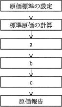
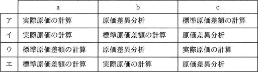

# [平成31年春期 午前 問77](https://www.ap-siken.com/kakomon/31_haru/q77.html)

#問題 #ストラテジ #企業活動 #会計・財務

解説を表示解説を隠す

<strong>問77</strong>　図に示す標準原価計算の手続について，a～cに該当する適切な組合せはどれか。  

<ul class="ap-choices">
<li class="ap-choice-item ap-wrong">

ア

a～cの組合せが誤っています。組合せは選択肢表を参照してください。

</li>
<li class="ap-choice-item ap-correct">

イ

正しい。aは実際原価の計算、bは標準原価差額の計算、cは原価差異分析です。

</li>
<li class="ap-choice-item ap-wrong">

ウ

a～cの組合せが誤っています。組合せは選択肢表を参照してください。

</li>
<li class="ap-choice-item ap-wrong">

エ

a～cの組合せが誤っています。組合せは選択肢表を参照してください。

</li>
</ul>

<h4>解説</h4>

<a href="用語/標準原価計算" class="internal-link" data-href="用語/標準原価計算">標準原価計算</a>とは、実際に必要となった実際原価ではなく、統計などに基づいて算定した標準原価によって製品原価を計算する方式です。標準原価と実際に掛かった原価を比較することで、その原因を分析し、<a href="用語/原価管理" class="internal-link" data-href="用語/原価管理">原価管理</a>を効率的に行うことを目的とした<a href="用語/原価計算" class="internal-link" data-href="用語/原価計算">原価計算</a>方式です。  <a href="用語/標準原価計算" class="internal-link" data-href="用語/標準原価計算">標準原価計算</a>の手順は以下のとおりです（簡略化のため完成品に絞った説明にしてあります）。

<ul>
<li>原価標準の設定 … 原価標準とは、製品1単位あたりの標準原価です。各原価要素ごと（直接材料費、直接労務費、製造間接費）に製品1単位あたりの標準原価を算出し、それらを合計することにより設定します</li>
<li>標準原価の計算 … <a href="用語/原価計算" class="internal-link" data-href="用語/原価計算">原価計算</a>期間の製品生産量に基づいて、完成品の標準原価（原価標準×完成品数量）を算出します</li>
<li>実際原価の計算 … 実際に完成品を作るのに要した金額を計算します。</li>
<li>標準原価差額の計算 … 標準原価と実際原価の差額を計算します</li>
<li>原価差異分析 … 差額がどの要素に起因するものなのかを分析します。原価差異は直接材料費差異、直接労務費差異、製造間接費差異に大別されます。</li>
<li>原価報告 … 以上の計算結果を書式に記述し、報告します</li>
</ul>

したがって、aには実際原価の計算、bには標準原価差額の計算、cには原価差異分析が入ります。

