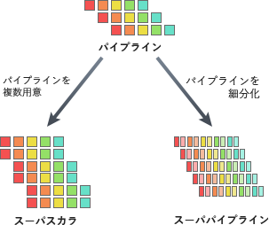

# [平成31年春期 午前 問8](https://www.ap-siken.com/kakomon/31_haru/q8.html)

#問題 #テクノロジ #コンピュータ構成要素 #プロセッサ

解説を表示解説を隠す

<strong>問8</strong>　スーパースカラの説明として，適切なものはどれか。

<ul class="ap-choices">
<li class="ap-choice-item ap-wrong">

ア　一つのチップ内に複数のプロセッサコアを実装し，複数のスレッドを並列に実行する。

これは<a href="用語/マルチコアプロセッサ" class="internal-link" data-href="用語/マルチコアプロセッサ">マルチコアプロセッサ</a>の説明です。

</li>
<li class="ap-choice-item ap-wrong">

イ　一つのプロセッサコアで複数のスレッドを切り替えて並列に実行する。

これは<a href="用語/マルチタスク" class="internal-link" data-href="用語/マルチタスク">マルチタスク</a>の説明です。

</li>
<li class="ap-choice-item ap-wrong">

ウ　一つの命令で，複数の異なるデータに対する演算を，複数の演算器を用いて並列に実行する。

これは<a href="用語/SIMD" class="internal-link" data-href="用語/SIMD">SIMD</a>の説明です。

</li>
<li class="ap-choice-item ap-correct">

エ　並列実行可能な複数の命令を，複数の演算器に振り分けることによって並列に実行する。

正しい。詳細：<a href="用語/スーパースカラ" class="internal-link" data-href="用語/スーパースカラ">スーパースカラ</a>

</li>
</ul>

<h4>解説</h4>

<a href="用語/スーパースカラ" class="internal-link" data-href="用語/スーパースカラ">スーパースカラ</a>は、<a href="用語/CPU" class="internal-link" data-href="用語/CPU">CPU</a>内部に複数のパイプラインを用意して、パイプラインの各ステージを並列に実行することで処理を高速化する方式です。下図ではパイプラインを複数用意したものを<a href="用語/スーパースカラ" class="internal-link" data-href="用語/スーパースカラ">スーパースカラ</a>と呼んでいますが、各処理機構がパイプライン化されていなくても、複数の命令を一度に読み込み同時に並列実行するものであれば<a href="用語/スーパースカラ" class="internal-link" data-href="用語/スーパースカラ">スーパースカラ</a>と呼ばれます。<a href="用語/スーパースカラ" class="internal-link" data-href="用語/スーパースカラ">スーパースカラ</a>の仕組みを最大限に活かすには、並列実行を乱す要因をできる限り解消しておく必要があります。

