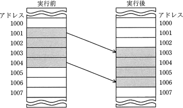
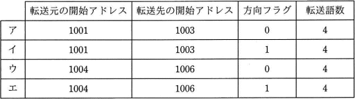
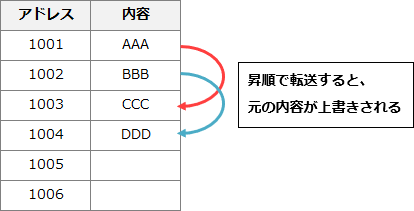
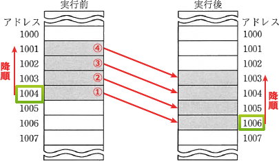

# [平成31年春期 午前 問9](https://www.ap-siken.com/kakomon/31_haru/q9.html)

#問題 #テクノロジ #コンピュータ構成要素 #プロセッサ

解説を表示解説を隠す

<strong>問9</strong>　同一メモリ上で転送するとき，転送元の開始アドレス，転送先の開始アドレス，方向フラグ及び転送語数をパラメータとして指定することでブロック転送ができるCPUがある。図のようにアドレス 1001 から 1004 の内容をアドレス 1003 から 1006 に転送する場合，パラメータとして適切なものはどれか。ここで，転送は開始アドレスから1語ずつ行われ，方向フラグに0を指定するとアドレスの昇順に，1を指定するとアドレスの降順に転送を行うものとする。  

<ul class="ap-choices">
<li class="ap-choice-item ap-wrong">

ア

前述の図解どおり、1005～1006番地にコピーされるべき1003～1004番地の内容が、転送前に1001～1002番地の内容で上書きされてしまうため誤りです。

</li>
<li class="ap-choice-item ap-wrong">

イ

転送元アドレスが1001～998番地、転送先アドレスが1003～1000番地となってしまうため誤りです。

</li>
<li class="ap-choice-item ap-wrong">

ウ

転送元アドレスが1004～1007番地、転送先アドレスが1006～1009番地となってしまうため誤りです。

</li>
<li class="ap-choice-item ap-correct">

エ

正しい。

</li>
</ul>

<h4>解説</h4>

同一の<a href="用語/メモリ" class="internal-link" data-href="用語/メモリ">メモリ</a>空間において、アドレス「1001,1002,1003,1004」のデータを、アドレス「1003,1004,1005,1006」に転送することになります。転送先アドレスである1003～1004番地は、転送元アドレスでもあるので、1001番地から昇順で転送すると、1001～1002番地の内容で1003～1004番地の内容が上書きされることになり、本来の1003～1004番地の内容（下図の"CCC"・"DDD"）を1005～1006番地に転送することができません。

このため正しく転送するには、転送元は1004番から、転送先は1006番からそれぞれ降順で転送する必要があります。したがって、転送元の開始アドレスに1004、転送先の開始アドレスに1006、方向フラグには1(降順)を指定することになります。

