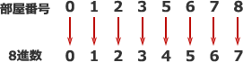

# [令和元年秋期 午前 問1](https://www.ap-siken.com/kakomon/01_aki/q1.html)

#問題 #テクノロジ #基礎理論 #離散数学

解説を表示解説を隠す

<strong>問1</strong>　あるホテルは客室を1,000部屋もち，部屋番号は，数字4と9を使用しないで0001から順に数字4桁の番号としている。部屋番号が0330の部屋は，何番目の部屋か。

<ul class="ap-choices">
<li class="ap-choice-item ap-wrong">

ア　204

8進数0330を10進数に直すと216であり、204ではありません。

</li>
<li class="ap-choice-item ap-wrong">

イ　210

8進数0330を10進数に直すと216であり、210ではありません。

</li>
<li class="ap-choice-item ap-correct">

ウ　216

正しい。部屋番号0330を8進数とみなして10進数に変換すると216になります。詳細：<a href="用語/基数" class="internal-link" data-href="用語/基数">基数</a>

</li>
<li class="ap-choice-item ap-wrong">

エ　218

8進数0330を10進数に直すと216であり、218ではありません。

</li>
</ul>

<h4>解説</h4>

数字4と9を使用しないということは、0～3、5～8の8種類の数字のみを使うということです。1つの桁に8種類の数字を使えるということは、1つの桁に0～7を使う8進数と同じ考え方を適用できることになります。

つまり、部屋番号の数字を以下のように対応させて10進数に変換すれば、部屋番号の0001から数えて何番目の部屋なのかを素早く計算できます。

対象の部屋番号は0330なので数字の置き換えは発生せず、そのまま8進数を10進数に変換する計算を行えば大丈夫です。 82×3＋8×3＝192＋24＝216

したがって「ウ」が正解です。

