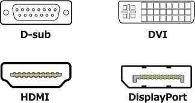

# [令和元年秋期 午前 問11](https://www.ap-siken.com/kakomon/01_aki/q11.html)

#問題 #テクノロジ #コンピュータ構成要素 #入出力デバイス

解説を表示解説を隠す

<strong>問11</strong>　PCとディスプレイの接続に用いられるインタフェースの一つであるDisplayPortの説明として，適切なものはどれか。

<ul class="ap-choices">
<li class="ap-choice-item ap-wrong">

ア　DVIと同じサイズのコネクタで接続する。

DVIコネクタは約37mm、<a href="用語/DisplayPort" class="internal-link" data-href="用語/DisplayPort">DisplayPort</a>は約16mmで、<a href="用語/DisplayPort" class="internal-link" data-href="用語/DisplayPort">DisplayPort</a>はDVIの半分以下の大きさです。

</li>
<li class="ap-choice-item ap-wrong">

イ　アナログ映像信号も伝送できる。

<a href="用語/DisplayPort" class="internal-link" data-href="用語/DisplayPort">DisplayPort</a>は<a href="用語/デジタル" class="internal-link" data-href="用語/デジタル">デジタル</a>専用です。<a href="用語/アナログ" class="internal-link" data-href="用語/アナログ">アナログ</a>・<a href="用語/デジタル" class="internal-link" data-href="用語/デジタル">デジタル</a>両用なのはDVI-Iです。

</li>
<li class="ap-choice-item ap-correct">

ウ　映像と音声をパケット化して，シリアル伝送できる。

正しい。<a href="用語/DisplayPort" class="internal-link" data-href="用語/DisplayPort">DisplayPort</a>は、音声と映像の信号を<a href="用語/パケット" class="internal-link" data-href="用語/パケット">パケット</a>にして伝送することが特徴です。

</li>
<li class="ap-choice-item ap-wrong">

エ　著作権保護の機能をもたない。

<a href="用語/DisplayPort" class="internal-link" data-href="用語/DisplayPort">DisplayPort</a>はHDCPという<a href="用語/著作権" class="internal-link" data-href="用語/著作権">著作権</a>保護技術に対応しています。HDCPは再生機器からディスプレイなどの表示機器に<a href="用語/デジタル" class="internal-link" data-href="用語/デジタル">デジタル</a>信号を送るときに送受信経路を暗号化する技術です。

</li>
</ul>

<h4>解説</h4>

<a href="用語/DisplayPort" class="internal-link" data-href="用語/DisplayPort">DisplayPort</a>は、<a href="用語/デジタル" class="internal-link" data-href="用語/デジタル">デジタル</a>映像インタフェースのDVIで問題とされていたコネクタサイズの大きさ、音声伝送ができないといった点を解決し、後継規格とするべく業界団体のVESAにより策定されたインタフェースです。8K解像度(7680×4320)の伝送にも対応する(v1.4)など、下記4つの映像インタフェースのうちでスペック上は最も優れています。

