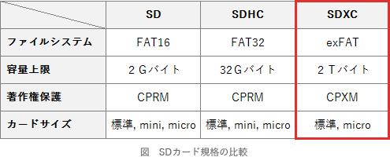

# [令和元年秋期 午前 問12](https://www.ap-siken.com/kakomon/01_aki/q12.html)

#問題 #テクノロジ #コンピュータ構成要素 #メモリ

解説を表示解説を隠す

<strong>問12</strong>　SDメモリカードの上位規格の一つであるSDXCの特徴として，適切なものはどれか。

<ul class="ap-choices">
<li class="ap-choice-item ap-wrong">

ア　GPS，カメラ，無線LANアダプタなどの周辺機能をハードウェアとしてカードに搭載している。

これはSDIO(SD input/output)の説明です。

</li>
<li class="ap-choice-item ap-wrong">

イ　SDメモリカードの4分の1以下の小型サイズで，最大32Gバイトの容量をもつ。

これはmicro SDHCの説明です。

</li>
<li class="ap-choice-item ap-wrong">

ウ　著作権保護技術としてAACSを採用し，従来のSDメモリカードよりもセキュリティが強化された。

SDXCに採用されている<a href="用語/著作権" class="internal-link" data-href="用語/著作権">著作権</a>保護技術は、<a href="用語/CPRM" class="internal-link" data-href="用語/CPRM">CPRM</a>を発展させたCPXMです。

</li>
<li class="ap-choice-item ap-correct">

エ　ファイルシステムにexFATを採用し，最大2Tバイトの容量に対応できる。

正しい。SDXCの説明です。

</li>
</ul>

<h4>解説</h4>

SDカードは、メモリカードの規格の1つです。携帯電話やスマートフォン、デジタルカメラやゲーム機などの記憶装置として利用されるほか、使いやすく持ち運びしやすいのでUSBメモリとともに手軽な記憶メディアとして使用されています。

SDカードを記憶容量で分けると以下の3規格が存在します。

SDXC(SD eXtended Capacity)は、2009年に策定された規格で、ファイルシステムにexFATを採用することで記憶容量の上限を2Tバイトまで引き上げたものです。また標準サイズのほかにMicroSDXCという小さいタイプもあります。

したがって「エ」が正解です。

