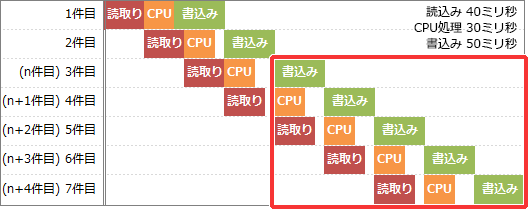

# [令和元年秋期 午前 問15](https://www.ap-siken.com/kakomon/01_aki/q15.html)

#問題 #テクノロジ #システム構成要素 #システムの評価指標

解説を表示解説を隠す

<strong>問15</strong>　1件のデータを処理する際に，読取りには40ミリ秒，CPU処理には30ミリ秒，書込みには50ミリ秒掛かるプログラムがある。このプログラムで，n件目の書込みと並行してn＋1件目のCPU処理とn＋2件目の読取りを実行すると，1分当たりの最大データ処理件数は幾つか。ここで，OSのオーバーヘッドは考慮しないものとする。

<ul class="ap-choices">
<li class="ap-choice-item ap-wrong">

ア　500

読取り・<a href="用語/CPU" class="internal-link" data-href="用語/CPU">CPU</a>処理・書込みの所要時間をすべて足した120ミリ秒を1件あたりの処理時間とみなして計算した誤り（60,000÷120＝500）。

</li>
<li class="ap-choice-item ap-wrong">

イ　666

並列化を考慮せず，読取り40ミリ秒と<a href="用語/CPU" class="internal-link" data-href="用語/CPU">CPU</a>処理30ミリ秒の合計90ミリ秒を1件あたりの処理時間とみなした誤り（60,000÷90≒666）。

</li>
<li class="ap-choice-item ap-wrong">

ウ　750

書込み50ミリ秒に加え<a href="用語/CPU" class="internal-link" data-href="用語/CPU">CPU</a>処理30ミリ秒を重ねて80ミリ秒を1件あたりの処理時間とみなした誤り（60,000÷80＝750）。

</li>
<li class="ap-choice-item ap-correct">

エ　1,200

正しい。並列処理のボトルネックとなる書込み50ミリ秒あたり1件が処理できる（60,000÷50＝1,200）。

</li>
</ul>

<h4>解説</h4>

並列処理の流れを整理して図で表すと次のようになります。

上図の赤枠部分を見るとわかるように、50ミリ秒を要する書込み処理が並列処理のボトルネックとなり、1分間に処理できる書込み件数がそのまま最大<a href="用語/データ処理" class="internal-link" data-href="用語/データ処理">データ処理</a>件数に相当することがわかります。1分は「60秒×1,000ミリ秒＝60,000ミリ秒」なので、1分当たりの最大<a href="用語/データ処理" class="internal-link" data-href="用語/データ処理">データ処理</a>件数は、60,000ミリ秒÷50ミリ秒＝1,200件したがって「エ」の1,200件が適切です。

