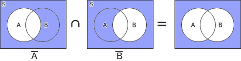
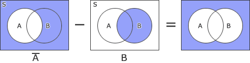
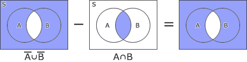
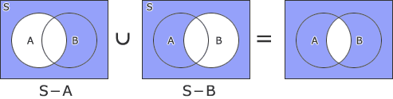
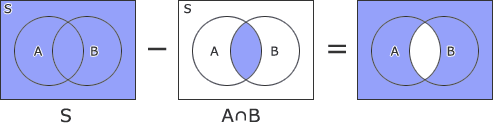

# [令和元年秋期 午前 問2](https://www.ap-siken.com/kakomon/01_aki/q2.html)

#問題 #テクノロジ #基礎理論 #離散数学

解説を表示解説を隠す

<strong>問2</strong>　全体集合S内に異なる部分集合AとBがあるとき，A̅∩B̅に等しいものはどれか。ここで，A∪BはAとBの和集合，A∩BはAとBの積集合，A̅はSにおけるAの補集合，A－BはAからBを除いた差集合を表す。

<ul class="ap-choices">
<li class="ap-choice-item ap-correct">

ア　A̅－B

正しい。<a href="用語/ベン図" class="internal-link" data-href="用語/ベン図">ベン図</a>よりA̅∩B̅と一致する領域です。

</li>
<li class="ap-choice-item ap-wrong">

イ　(A̅∪B̅)－(A∩B)

対称差に相当する領域。A̅∩B̅とは一致しません。

</li>
<li class="ap-choice-item ap-wrong">

ウ　(S－A)∪(S－B)

A̅∪B̅（<a href="用語/和集合" class="internal-link" data-href="用語/和集合">和集合</a>）の形。<a href="用語/積集合" class="internal-link" data-href="用語/積集合">積集合</a>A̅∩B̅ではありません。

</li>
<li class="ap-choice-item ap-wrong">

エ　S－(A∩B)

(A∩B)の<a href="用語/補集合" class="internal-link" data-href="用語/補集合">補集合</a>。問のA̅∩B̅とは異なります。

</li>
</ul>

<h4>解説</h4>

それぞれの演算を<a href="用語/ベン図" class="internal-link" data-href="用語/ベン図">ベン図</a>で表すと次のようになります。

[問題文 A̅∩B̅] 

A̅－B 

(A̅∪B̅)－(A∩B) 

(S－A)∪(S－B) 

S－(A∩B) 

したがってA̅∩B̅と結果が等しくなる演算は「A̅－B」となります。

