# [令和元年秋期 午前 問23](https://www.ap-siken.com/kakomon/01_aki/q23.html)

#問題 #テクノロジ #ハードウェア #ハードウェア

解説を表示解説を隠す

<strong>問23</strong>　3ビットのデータx1，x2，x3に偶数パリティビットcを付加する回路はどれか。

<ul class="ap-choices">
<li class="ap-choice-item ap-wrong">

ア　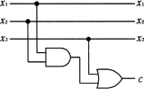

x1=1、x2=0、x3=1 を入力するとcが1になり誤りです。

</li>
<li class="ap-choice-item ap-wrong">

イ　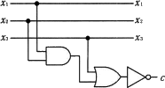

第1の検証ではc=0だが、x1=x2=x3=1 のときcが0になり誤りです。

</li>
<li class="ap-choice-item ap-correct">

ウ　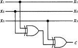

正しい。x1 XOR x2 XOR x3 により偶数<a href="用語/パリティ" class="internal-link" data-href="用語/パリティ">パリティ</a><a href="用語/ビット" class="internal-link" data-href="用語/ビット">ビット</a>を求めます。

</li>
<li class="ap-choice-item ap-wrong">

エ　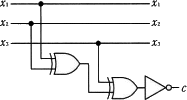

x1=1、x2=0、x3=1 を入力するとcが1になり誤りです。出力前のNOTにより奇数<a href="用語/パリティ" class="internal-link" data-href="用語/パリティ">パリティ</a>になります。

</li>
</ul>

<h4>解説</h4>

回路図中の各記号の意味は次の通りです。

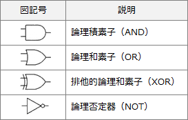

偶数<a href="用語/パリティ" class="internal-link" data-href="用語/パリティ">パリティ</a><a href="用語/ビット" class="internal-link" data-href="用語/ビット">ビット</a>は、1の<a href="用語/ビット" class="internal-link" data-href="用語/ビット">ビット</a>の数が偶数になるように<a href="用語/パリティ" class="internal-link" data-href="用語/パリティ">パリティ</a><a href="用語/ビット" class="internal-link" data-href="用語/ビット">ビット</a>を付加する方式です。

例）

101 … 1の<a href="用語/ビット" class="internal-link" data-href="用語/ビット">ビット</a>が偶数個なので<a href="用語/パリティ" class="internal-link" data-href="用語/パリティ">パリティ</a><a href="用語/ビット" class="internal-link" data-href="用語/ビット">ビット</a>は0 → 1010

100 … 1の<a href="用語/ビット" class="internal-link" data-href="用語/ビット">ビット</a>が奇数個なので<a href="用語/パリティ" class="internal-link" data-href="用語/パリティ">パリティ</a><a href="用語/ビット" class="internal-link" data-href="用語/ビット">ビット</a>は1 → 1001

回路図の問題では、仮の値を回路に入力してみることで正しい構成になっているか確認するのが確実です。ここでは、x1=1、x2＝0、x3＝1 を使用します。出力cが0になれば正しい<a href="用語/パリティ" class="internal-link" data-href="用語/パリティ">パリティ</a><a href="用語/ビット" class="internal-link" data-href="用語/ビット">ビット</a>が出力されたことになります。

cの値が1になるので誤りです。 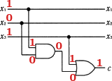

cの値が0になので正解の可能性があります。 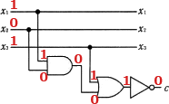

cの値が0になので正解の可能性があります。 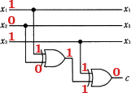

cの値が1になるので誤りです。 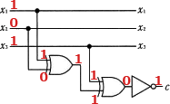

さらに残った2つで検証を続けます。次に x1=1、x2＝1、x3＝1 を与えてみます。出力cが1になれば正しい<a href="用語/パリティ" class="internal-link" data-href="用語/パリティ">パリティ</a><a href="用語/ビット" class="internal-link" data-href="用語/ビット">ビット</a>が出力されたことになります。

「イ」出力が0になるので誤りです。 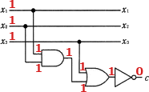

「ウ」出力が1になるので正解です。 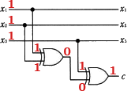

したがって消去法で「ウ」が正解とわかります。

一般的に、<a href="用語/ビット" class="internal-link" data-href="用語/ビット">ビット</a>列中の1の個数が奇数が偶数かを確認する方法としてXOR演算を使う方法があります。全ての<a href="用語/ビット" class="internal-link" data-href="用語/ビット">ビット</a>をXOR演算でつないだとき結果が1となれば1の個数は奇数、0であれば偶数となります。「ウ」の回路では、この性質を利用し「x1 XOR x2 XOR x3」を行うことで偶数<a href="用語/パリティ" class="internal-link" data-href="用語/パリティ">パリティ</a><a href="用語/ビット" class="internal-link" data-href="用語/ビット">ビット</a>の値を求めています。なお、「ウ」の出力cの前に<a href="用語/NOT回路" class="internal-link" data-href="用語/NOT回路">NOT回路</a>を加えた「エ」は奇数<a href="用語/パリティ" class="internal-link" data-href="用語/パリティ">パリティ</a><a href="用語/ビット" class="internal-link" data-href="用語/ビット">ビット</a>を付加する回路になります。

