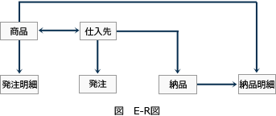

# [令和元年秋期 午前 問26](https://www.ap-siken.com/kakomon/01_aki/q26.html)

#問題 #テクノロジ #データベース #データベース設計

解説を表示解説を隠す

<strong>問26</strong>　データベースの概念設計に用いられ，対象世界を，実体と実体間の関連という二つの概念で表現するデータモデルはどれか。

<ul class="ap-choices">
<li class="ap-choice-item ap-correct">

ア　E-Rモデル

正しい。詳細：<a href="用語/E-Rモデル" class="internal-link" data-href="用語/E-Rモデル">E-Rモデル</a>

</li>
<li class="ap-choice-item ap-wrong">

イ　階層モデル

データを<a href="用語/木構造" class="internal-link" data-href="用語/木構造">木構造</a>で構成し、親と子を1対多で関連付けるモデルであり、本問の条件には当てはまらない。詳細：<a href="用語/階層モデル" class="internal-link" data-href="用語/階層モデル">階層モデル</a>

</li>
<li class="ap-choice-item ap-wrong">

ウ　関係モデル

データを二次元の表として管理するモデルであり、本問の条件には当てはまらない。詳細：<a href="用語/関係モデル" class="internal-link" data-href="用語/関係モデル">関係モデル</a>

</li>
<li class="ap-choice-item ap-wrong">

エ　ネットワークモデル

データ同士の<a href="用語/関連" class="internal-link" data-href="用語/関連">関連</a>を網の目のように表現するモデルであり、本問の条件には当てはまらない。詳細：<a href="用語/ネットワークモデル" class="internal-link" data-href="用語/ネットワークモデル">ネットワークモデル</a>

</li>
</ul>

<h4>解説</h4>

<a href="用語/E-R図" class="internal-link" data-href="用語/E-R図">E-R図</a>(Entity-Relationship Diagram)は、<a href="用語/データベース" class="internal-link" data-href="用語/データベース">データベース</a>化の対象となる<a href="用語/実体" class="internal-link" data-href="用語/実体">実体</a>（<a href="用語/エンティティ" class="internal-link" data-href="用語/エンティティ">エンティティ</a>）と<a href="用語/実体" class="internal-link" data-href="用語/実体">実体</a>の持つ<a href="用語/属性" class="internal-link" data-href="用語/属性">属性</a>（アトリビュート)、<a href="用語/実体" class="internal-link" data-href="用語/実体">実体</a>間の<a href="用語/関連" class="internal-link" data-href="用語/関連">関連</a>（<a href="用語/リレーションシップ" class="internal-link" data-href="用語/リレーションシップ">リレーションシップ</a>）を表現した図です。任意のオブジェクトとその<a href="用語/関連" class="internal-link" data-href="用語/関連">関連</a>を<a href="用語/データモデル" class="internal-link" data-href="用語/データモデル">データモデル</a>化することができますが、<a href="用語/関係モデル" class="internal-link" data-href="用語/関係モデル">関係モデル</a>との親和性が非常に高いため、関係<a href="用語/データベース" class="internal-link" data-href="用語/データベース">データベース</a>の概念設計に一般的に利用されています。

