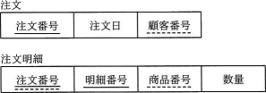

# [令和元年秋期 午前 問27](https://www.ap-siken.com/kakomon/01_aki/q27.html)

#問題 #テクノロジ #データベース #データ操作

解説を表示解説を隠す

<strong>問27</strong>　図のような関係データベースの"注文"表と"注文明細"表がある。"注文"表の行を削除すると，対応する"注文明細"表の行が，自動的に削除されるようにしたい。SQL文のON DELETE句に指定する語句はどれか。ここで，図中の実線の下線は主キーを，破線の下線は外部キーを表す。 

<ul class="ap-choices">
<li class="ap-choice-item ap-correct">

ア　CASCADE

正しい。詳細：<a href="用語/CASCADE" class="internal-link" data-href="用語/CASCADE">CASCADE</a>

</li>
<li class="ap-choice-item ap-wrong">

イ　INTERSECT

これはINTERSECTの説明です。複数の表から両方に共通する行を抽出する集合演算を行う<a href="用語/SQL" class="internal-link" data-href="用語/SQL">SQL</a>文です。<a href="用語/積集合" class="internal-link" data-href="用語/積集合">積集合</a>を求めるのに使います。

</li>
<li class="ap-choice-item ap-wrong">

ウ　RESTRICT

これはRESTRICTの説明です。<a href="用語/参照制約" class="internal-link" data-href="用語/参照制約">参照制約</a>性を損なう削除や更新処理の要求に対して、データ更新または削除を禁止する指定です。

</li>
<li class="ap-choice-item ap-wrong">

エ　UNIQUE

これはUNIQUEの説明です。データベースにデータを追加したり更新する際に、列や列のグループに格納される値が表内のすべての行で一意となるように制限する指定です。

</li>
</ul>

<h4>解説</h4>

<a href="用語/参照制約" class="internal-link" data-href="用語/参照制約">参照制約</a>が設定されているデータベースでは、<a href="用語/主キー" class="internal-link" data-href="用語/主キー">主キー</a>を含む行が削除されたり、更新されたりすると、参照関係が崩れることがあります。<a href="用語/DBMS" class="internal-link" data-href="用語/DBMS">DBMS</a>では、参照整合性が損なわれるデータ操作が行われたときに、どのような形で参照整合性を回復するかを、<a href="用語/外部キー" class="internal-link" data-href="用語/外部キー">外部キー</a>制約のON DELETEやON UPDATEに指定しておくことができます。指定できる動作は次の5種類です。

<a href="用語/CASCADE" class="internal-link" data-href="用語/CASCADE">CASCADE</a>　参照先のデータが更新・削除されると、対応する<a href="用語/外部キー" class="internal-link" data-href="用語/外部キー">外部キー</a>の値も自動的に更新・削除される RESTRICT　<a href="用語/参照制約" class="internal-link" data-href="用語/参照制約">参照制約</a>違反となるデータの更新・削除を拒否する NO ACTION（デフォルトの動作）　処理の終了時に参照整合性を確認し、違反していれば更新・削除を拒否する SET <a href="用語/NULL" class="internal-link" data-href="用語/NULL">NULL</a>　参照先のデータが更新・削除されると、対応する<a href="用語/外部キー" class="internal-link" data-href="用語/外部キー">外部キー</a>の値に<a href="用語/NULL" class="internal-link" data-href="用語/NULL">NULL</a>が設定される SET DEFAULT　参照先のデータが更新・削除されると、対応する<a href="用語/外部キー" class="internal-link" data-href="用語/外部キー">外部キー</a>の値にデフォルト値が設定される

本問では、"注文明細"表から参照されている"注文"表の行が削除されたときに、対応する"注文明細"表の行を自動的に削除したいので、"注文明細"表の<a href="用語/外部キー" class="internal-link" data-href="用語/外部キー">外部キー</a><a href="用語/属性" class="internal-link" data-href="用語/属性">属性</a>の定義に「ON DELETE <a href="用語/CASCADE" class="internal-link" data-href="用語/CASCADE">CASCADE</a>」と記述することになります。

CREATE TABLE 注文明細 ( … FOREIGN KEY (注文番号) REFERENCES 注文(注文番号) ON DELETE <a href="用語/CASCADE" class="internal-link" data-href="用語/CASCADE">CASCADE</a> … )

