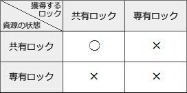

# [令和元年秋期 午前 問28](https://www.ap-siken.com/kakomon/01_aki/q28.html)

#問題 #テクノロジ #データベース #トランザクション処理

解説を表示解説を隠す

<strong>問28</strong>　RDBMSのロックに関する記述のうち，適切なものはどれか。ここで，X，Yはトランザクションとする。

<ul class="ap-choices">
<li class="ap-choice-item ap-wrong">

ア　XがA表内の特定行aに対して共有ロックを獲得しているときは，YはA表内の別の特定行bに対して専有ロックを獲得することができない。

<a href="用語/共有ロック" class="internal-link" data-href="用語/共有ロック">共有ロック</a>が掛けられているのは行aなので、それとは別の行bに対する<a href="用語/専有ロック" class="internal-link" data-href="用語/専有ロック">専有ロック</a>は獲得可能です。

</li>
<li class="ap-choice-item ap-correct">

イ　XがA表内の特定行aに対して共有ロックを獲得しているときは，YはA表に対して専有ロックを獲得することができない。

正しい。<a href="用語/共有ロック" class="internal-link" data-href="用語/共有ロック">共有ロック</a>が掛けられている行aは表Aの一部なので、表A全体に対する<a href="用語/専有ロック" class="internal-link" data-href="用語/専有ロック">専有ロック</a>は獲得できません。

</li>
<li class="ap-choice-item ap-wrong">

ウ　XがA表に対して共有ロックを獲得しているときでも，YはA表に対して専有ロックを獲得することができる。

<a href="用語/共有ロック" class="internal-link" data-href="用語/共有ロック">共有ロック</a>が掛けられている資源に対して、他の<a href="用語/トランザクション" class="internal-link" data-href="用語/トランザクション">トランザクション</a>が獲得可能なのは<a href="用語/共有ロック" class="internal-link" data-href="用語/共有ロック">共有ロック</a>のみです。

</li>
<li class="ap-choice-item ap-wrong">

エ　XがA表に対して専有ロックを獲得しているときでも，YはA表内の特定行aに対して専有ロックを獲得することができる。

A表には<a href="用語/専有ロック" class="internal-link" data-href="用語/専有ロック">専有ロック</a>が掛けられているので、A表の一部である行aに対する<a href="用語/ロック" class="internal-link" data-href="用語/ロック">ロック</a>は獲得できません。

</li>
</ul>

<h4>解説</h4>

共有・専有の2種類の<a href="用語/ロック" class="internal-link" data-href="用語/ロック">ロック</a>の違いを確認しておきましょう。

<a href="用語/共有ロック" class="internal-link" data-href="用語/共有ロック">共有ロック</a>　データを読込むときに使う<a href="用語/ロック" class="internal-link" data-href="用語/ロック">ロック</a>で、資源がこの状態の場合は他の<a href="用語/トランザクション" class="internal-link" data-href="用語/トランザクション">トランザクション</a>による更新処理ができなくなる(読込みは可能)。

<a href="用語/専有ロック" class="internal-link" data-href="用語/専有ロック">専有ロック</a>　データを更新するときに使う<a href="用語/ロック" class="internal-link" data-href="用語/ロック">ロック</a>で、資源がこの状態の場合は他の<a href="用語/トランザクション" class="internal-link" data-href="用語/トランザクション">トランザクション</a>による読込みや更新ができなくなる。

上記の性質から、ある資源に共有または<a href="用語/専有ロック" class="internal-link" data-href="用語/専有ロック">専有ロック</a>が掛けれられているときの新たな<a href="用語/ロック" class="internal-link" data-href="用語/ロック">ロック</a>の可否は次の表の通りになります。 

つまり、資源に掛けられている<a href="用語/ロック" class="internal-link" data-href="用語/ロック">ロック</a>が"共有"である場合にのみ、別の<a href="用語/トランザクション" class="internal-link" data-href="用語/トランザクション">トランザクション</a>が新たに"<a href="用語/共有ロック" class="internal-link" data-href="用語/共有ロック">共有ロック</a>"を掛けることができます。

これを踏まえて各記述を検証すると以下のように判断できます。

