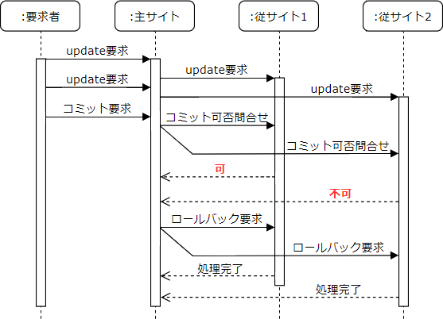

# [令和元年秋期 午前 問30](https://www.ap-siken.com/kakomon/01_aki/q30.html)

#問題 #テクノロジ #データベース #トランザクション処理

解説を表示解説を隠す

<strong>問30</strong>　分散トランザクション管理において，複数サイトのデータベースを更新する場合に用いられる2相コミットプロトコルに関する記述のうち，適切なものはどれか。

<ul class="ap-choices">
<li class="ap-choice-item ap-wrong">

ア　主サイトが一部の従サイトからのコミット準備完了メッセージを受け取っていない場合，コミット準備が完了した従サイトに対してだけコミット要求を発行する。

第1相で一部の従サイトから応答が得られない場合、主サイトは<a href="用語/トランザクション" class="internal-link" data-href="用語/トランザクション">トランザクション</a>を中止する。一部だけにコミット要求を出すと一貫性が保てない。

</li>
<li class="ap-choice-item ap-wrong">

イ　主サイトが一部の従サイトからのコミット準備完了メッセージを受け取っていない場合，全ての従サイトに対して再度コミット準備要求を発行する。

全ての従サイトからコミット準備完了を得られなかった場合、主サイトは<a href="用語/トランザクション" class="internal-link" data-href="用語/トランザクション">トランザクション</a>を中止し、アボート処理する。

</li>
<li class="ap-choice-item ap-correct">

ウ　主サイトが全ての従サイトからコミット準備完了メッセージを受け取った場合，全ての従サイトに対してコミット要求を発行する。

正しい。全ての従サイトからコミット可能というメッセージを受け取ったときのみ、主サイトは全ての従サイトにコミット要求を発行する。

</li>
<li class="ap-choice-item ap-wrong">

エ　主サイトが全ての従サイトに対してコミット準備要求を発行した場合，従サイトは，コミット準備が完了したときだけ応答メッセージを返す。

従サイトはコミットできるときはコミット可(Yes)、できないときはコミット不可(No)を主サイトに返す。

</li>
</ul>

<h4>解説</h4>

2相コミットプロトコルは、<a href="用語/トランザクション" class="internal-link" data-href="用語/トランザクション">トランザクション</a>を他のサイトに更新可能かどうかを確認する第1相と、更新を確定する第2相の2つのフェーズに分け、各サイトの<a href="用語/トランザクション" class="internal-link" data-href="用語/トランザクション">トランザクション</a>をコミットも<a href="用語/ロールバック" class="internal-link" data-href="用語/ロールバック">ロールバック</a>も可能な中間状態(セキュア状態)にした後、全サイトがコミットできる場合だけ<a href="用語/トランザクション" class="internal-link" data-href="用語/トランザクション">トランザクション</a>をコミットするという方法で<a href="用語/分散データベース" class="internal-link" data-href="用語/分散データベース">分散データベース</a>環境での<a href="用語/トランザクション" class="internal-link" data-href="用語/トランザクション">トランザクション</a>の原子性・一貫性を保証する手法です。

具体的には、各サイトの更新処理が終わった後に、コミットの調整を行う1つのノードを「主サイト」、ネットワーク上の他のノードを「従サイト」として、次の手順でコミットが行われます。

【第1相(投票相)】主サイトはネットワーク上の全ての従サイトにコミットの可否を問い合わせる。全ての従サイトは主サイトにコミットの可否を応答する。

【第2相(決定相)】全ての従サイトからコミットの合意を得られた場合は、全ての従サイトにコミットの実行要求を発行する。コミットの停止を応答した従サイトがあった場合、またはタイムアウトとなった場合は、全ての従サイトに<a href="用語/ロールバック" class="internal-link" data-href="用語/ロールバック">ロールバック</a>の実行要求を発行する。全ての従サイトは、コミット(または<a href="用語/ロールバック" class="internal-link" data-href="用語/ロールバック">ロールバック</a>)の完了とともに主サイトに処理完了のメッセージを送る。主サイトが、全ての従サイトからの処理完了メッセージを受け取り、<a href="用語/トランザクション" class="internal-link" data-href="用語/トランザクション">トランザクション</a>の完了となる。

したがって「ウ」が適切です。

