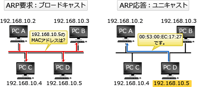

# [令和元年秋期 午前 問33](https://www.ap-siken.com/kakomon/01_aki/q33.html)

#問題 #テクノロジ #ネットワーク #通信プロトコル

解説を表示解説を隠す

<strong>問33</strong>　TCP/IPネットワークで使用されるARPの説明として，適切なものはどれか。

<ul class="ap-choices">
<li class="ap-choice-item ap-correct">

ア　IPアドレスからMACアドレスを得るためプロトコル

正しい。詳細：<a href="用語/ARP" class="internal-link" data-href="用語/ARP">ARP</a>

</li>
<li class="ap-choice-item ap-wrong">

イ　IPアドレスからホスト名(ドメイン名)を得るためのプロトコル

これは<a href="用語/DNS" class="internal-link" data-href="用語/DNS">DNS</a>の逆引きの説明です

</li>
<li class="ap-choice-item ap-wrong">

ウ　MACアドレスからIPアドレスを得るためのプロトコル

これは<a href="用語/RARP" class="internal-link" data-href="用語/RARP">RARP</a>の説明です

</li>
<li class="ap-choice-item ap-wrong">

エ　ホスト名(ドメイン名)からIPアドレスを得るためのプロトコル

これは<a href="用語/DNS" class="internal-link" data-href="用語/DNS">DNS</a>の正引きの説明です

</li>
</ul>

<h4>解説</h4>

<a href="用語/ARP" class="internal-link" data-href="用語/ARP">ARP</a>(Address Resolution Protocol)は、<a href="用語/IPアドレス" class="internal-link" data-href="用語/IPアドレス">IPアドレス</a>から対応する機器の<a href="用語/MAC" class="internal-link" data-href="用語/MAC">MAC</a>アドレスを取得するプロトコルです。したがって「ア」が正解です。

<a href="用語/IPアドレス" class="internal-link" data-href="用語/IPアドレス">IPアドレス</a>から<a href="用語/MAC" class="internal-link" data-href="用語/MAC">MAC</a>アドレスを得る手順は以下の通りです。<a href="用語/ARP" class="internal-link" data-href="用語/ARP">ARP</a>要求<a href="用語/フレーム" class="internal-link" data-href="用語/フレーム">フレーム</a>に送信元の<a href="用語/IPアドレス" class="internal-link" data-href="用語/IPアドレス">IPアドレス</a>・<a href="用語/MAC" class="internal-link" data-href="用語/MAC">MAC</a>アドレスと<a href="用語/MAC" class="internal-link" data-href="用語/MAC">MAC</a>アドレスを得たいノードの<a href="用語/IPアドレス" class="internal-link" data-href="用語/IPアドレス">IPアドレス</a>を格納して、イーサネットネットワークに<a href="用語/ブロードキャスト" class="internal-link" data-href="用語/ブロードキャスト">ブロードキャスト</a>する。<a href="用語/ARP" class="internal-link" data-href="用語/ARP">ARP</a>要求<a href="用語/フレーム" class="internal-link" data-href="用語/フレーム">フレーム</a>を受け取った各ノードは、<a href="用語/フレーム" class="internal-link" data-href="用語/フレーム">フレーム</a>内の解決対象<a href="用語/IPアドレス" class="internal-link" data-href="用語/IPアドレス">IPアドレス</a>が自身の<a href="用語/IPアドレス" class="internal-link" data-href="用語/IPアドレス">IPアドレス</a>と一致すれば、<a href="用語/ARP" class="internal-link" data-href="用語/ARP">ARP</a>応答<a href="用語/フレーム" class="internal-link" data-href="用語/フレーム">フレーム</a>に自身の<a href="用語/MAC" class="internal-link" data-href="用語/MAC">MAC</a>アドレスを格納して送信元に<a href="用語/ユニキャスト" class="internal-link" data-href="用語/ユニキャスト">ユニキャスト</a>で送信する。

