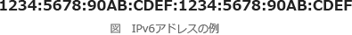

# [令和元年秋期 午前 問34](https://www.ap-siken.com/kakomon/01_aki/q34.html)

#問題 #テクノロジ #ネットワーク #通信プロトコル

解説を表示解説を隠す

<strong>問34</strong>　IPv6アドレスの表記として，適切なものはどれか。

<ul class="ap-choices">
<li class="ap-choice-item ap-wrong">

ア　2001:db8::3ab::ff01

"::"が2か所に使用されているので誤りです。

</li>
<li class="ap-choice-item ap-correct">

イ　2001:db8::3ab:ff01

正しい。<a href="用語/IPv6" class="internal-link" data-href="用語/IPv6">IPv6</a>表記として適切です。

</li>
<li class="ap-choice-item ap-wrong">

ウ　2001:db8.3ab:ff01

"."で連結している箇所があるので誤りです。

</li>
<li class="ap-choice-item ap-wrong">

エ　2001.db8.3ab.ff01

各16<a href="用語/ビット" class="internal-link" data-href="用語/ビット">ビット</a>セクションを"."で連結しているので誤りです。

</li>
</ul>

<h4>解説</h4>

<a href="用語/IPv6" class="internal-link" data-href="用語/IPv6">IPv6</a>アドレスのアドレス長は128<a href="用語/ビット" class="internal-link" data-href="用語/ビット">ビット</a>で、<a href="用語/IPv4" class="internal-link" data-href="用語/IPv4">IPv4</a>(32<a href="用語/ビット" class="internal-link" data-href="用語/ビット">ビット</a>)の4倍です。<a href="用語/IPv4" class="internal-link" data-href="用語/IPv4">IPv4</a>では32<a href="用語/ビット" class="internal-link" data-href="用語/ビット">ビット</a>を8<a href="用語/ビット" class="internal-link" data-href="用語/ビット">ビット</a>ごとに区切り、それぞれを10進数で表したものを"."で連結していましたが、<a href="用語/IPv6" class="internal-link" data-href="用語/IPv6">IPv6</a>では128<a href="用語/ビット" class="internal-link" data-href="用語/ビット">ビット</a>を16<a href="用語/ビット" class="internal-link" data-href="用語/ビット">ビット</a>ごとに区切り、それぞれを16進数で表したものを":"で連結して記述します。

また、記述量を減らすために以下の2つの規則に従った短縮表記が可能となっています。

各16<a href="用語/ビット" class="internal-link" data-href="用語/ビット">ビット</a>セクションの先行する 0 を省略する。例えば、0012 は 12 になる。ただし、16<a href="用語/ビット" class="internal-link" data-href="用語/ビット">ビット</a>セクションが 0000 のときは 0 とする。

0 の16<a href="用語/ビット" class="internal-link" data-href="用語/ビット">ビット</a>セクションが連続する場合は、連続する2個のコロン(::)で表す。例えば、2001:0db8:0000:0000:0000:ff00:0042:8329 は 2001:db8::ff00:42:8329 と表す。ただし、:: は1か所にだけ使用できる。

したがって正解は「イ」です。

