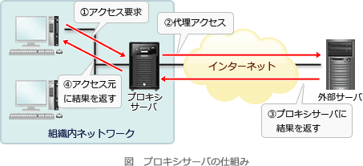

# [令和元年秋期 午前 問35](https://www.ap-siken.com/kakomon/01_aki/q35.html)

#問題 #テクノロジ #ネットワーク #データ通信と制御

解説を表示解説を隠す

<strong>問35</strong>　TCP/IPネットワークのフォワードプロキシに関する説明のうち，最も適切なものはどれか。

<ul class="ap-choices">
<li class="ap-choice-item ap-wrong">

ア　Webサーバと同一の組織内(例えば企業内)にあって，Webブラウザからのリクエストに対してWebサーバの代理として応答する。

これは<a href="用語/リバースプロキシ" class="internal-link" data-href="用語/リバースプロキシ">リバースプロキシ</a>の説明です。

</li>
<li class="ap-choice-item ap-wrong">

イ　Webブラウザと同一の組織内(例えば企業内)になければならない。

クラウド型プロキシサービスがあるように組織内に設置しなければならないという制約はありません。

</li>
<li class="ap-choice-item ap-correct">

ウ　Webブラウザの代理として，Webサーバに対するリクエストを送信する。

正しい。フォワードプロキシの説明です。

</li>
<li class="ap-choice-item ap-wrong">

エ　電子メールをインターネット上の複数のサーバを経由して転送する。

メールサーバの説明です。<a href="用語/プロキシサーバ" class="internal-link" data-href="用語/プロキシサーバ">プロキシサーバ</a>は<a href="用語/電子メール" class="internal-link" data-href="用語/電子メール">電子メール</a>の転送を行いません。

</li>
</ul>

<h4>解説</h4>

<a href="用語/プロキシサーバ" class="internal-link" data-href="用語/プロキシサーバ">プロキシサーバ</a>は、内部ネットワーク内の端末からの要求に応じてインターネットへのアクセスを代理する装置です。単にプロキシともいいます。<a href="用語/プロキシサーバ" class="internal-link" data-href="用語/プロキシサーバ">プロキシサーバ</a>を設置すると、キャッシュ機能によるレスポンス向上、認証やフィルタリングによるセキュリティ、内部ネットワークの秘匿化などの効果を期待できます。

したがって正解は「ウ」です。

