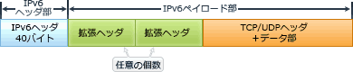
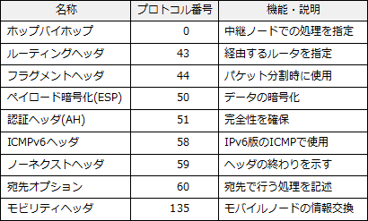

# [令和元年秋期 午前 問36](https://www.ap-siken.com/kakomon/01_aki/q36.html)

#問題 #テクノロジ #ネットワーク #通信プロトコル

解説を表示解説を隠す

<strong>問36</strong>　IPv6において，拡張ヘッダーを利用することによって実現できるセキュリティ機能はどれか。

<ul class="ap-choices">
<li class="ap-choice-item ap-wrong">

ア　URLフィルタリング機能

<a href="用語/URLフィルタリング" class="internal-link" data-href="用語/URLフィルタリング">URLフィルタリング</a>はWebアクセスを制御する機能であり、<a href="用語/IPv6" class="internal-link" data-href="用語/IPv6">IPv6</a>の拡張ヘッダーでは実現しません。

</li>
<li class="ap-choice-item ap-correct">

イ　暗号化通信機能

正しい。拡張ヘッダーの<a href="用語/認証" class="internal-link" data-href="用語/認証">認証</a>ヘッダ(AH)と暗号化ペイロード(ESP)がセキュリティ機能を実現します。

</li>
<li class="ap-choice-item ap-wrong">

ウ　情報漏えい検知機能

<a href="用語/情報漏えい" class="internal-link" data-href="用語/情報漏えい">情報漏えい</a>検知はデータの持ち出しを監視・検知する対策であり、<a href="用語/IPv6" class="internal-link" data-href="用語/IPv6">IPv6</a>の拡張ヘッダーでは実現しません。

</li>
<li class="ap-choice-item ap-wrong">

エ　マルウェア検知機能

マルウェア検知は不正プログラムの検出に関する対策であり、<a href="用語/IPv6" class="internal-link" data-href="用語/IPv6">IPv6</a>の拡張ヘッダーでは実現しません。

</li>
</ul>

<h4>解説</h4>

<a href="用語/IPv6" class="internal-link" data-href="用語/IPv6">IPv6</a>の拡張ヘッダーは、<a href="用語/IPv6" class="internal-link" data-href="用語/IPv6">IPv6</a>ヘッダーと<a href="用語/TCP" class="internal-link" data-href="用語/TCP">TCP</a>/<a href="用語/UDP" class="internal-link" data-href="用語/UDP">UDP</a>ヘッダーの間に挿入される、フラグやオプション情報を追加するための可変長のフィールドです。

拡張ヘッダーには次のような種類があります。

このうち、<a href="用語/認証" class="internal-link" data-href="用語/認証">認証</a>及び暗号化がセキュリティ機能を実現するものです。したがって「イ」が正解です。

AHとESPは<a href="用語/IPsec" class="internal-link" data-href="用語/IPsec">IPsec</a>の仕様に含まれるプロトコルです。<a href="用語/IPv6" class="internal-link" data-href="用語/IPv6">IPv6</a>環境では<a href="用語/ネットワーク層" class="internal-link" data-href="用語/ネットワーク層">ネットワーク層</a>(インターネット層)で暗号化を行う<a href="用語/IPsec" class="internal-link" data-href="用語/IPsec">IPsec</a>の実装が必須になっています。

