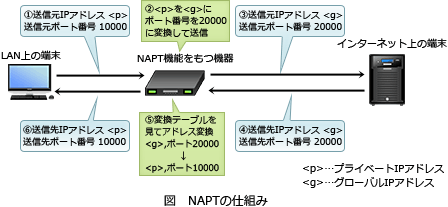

# [令和元年秋期 午前 問37](https://www.ap-siken.com/kakomon/01_aki/q37.html)

#問題 #テクノロジ #セキュリティ #情報セキュリティ対策

解説を表示解説を隠す

<strong>問37</strong>　インターネットとの接続において，ファイアウォールのNAPT機能によるセキュリティ上の効果はどれか。

<ul class="ap-choices">
<li class="ap-choice-item ap-wrong">

ア　DMZ上にある公開Webサーバの脆弱性を突く攻撃からWebサーバを防御できる。

<a href="用語/NAPT" class="internal-link" data-href="用語/NAPT">NAPT</a>では公開サーバの<a href="用語/脆弱性" class="internal-link" data-href="用語/脆弱性">脆弱性</a>攻撃は防げない。

</li>
<li class="ap-choice-item ap-wrong">

イ　インターネットから内部ネットワークへの侵入を検知し，検知後の通信を遮断できる。

これは<a href="用語/IDS" class="internal-link" data-href="用語/IDS">IDS</a>／<a href="用語/IPS" class="internal-link" data-href="用語/IPS">IPS</a>の説明です。

</li>
<li class="ap-choice-item ap-wrong">

ウ　インターネット上の特定のWebサービスを利用するHTTP通信を検知し，遮断できる。

これは<a href="用語/URLフィルタリング" class="internal-link" data-href="用語/URLフィルタリング">URLフィルタリング</a>の説明です。

</li>
<li class="ap-choice-item ap-correct">

エ　内部ネットワークからインターネットにアクセスする利用者PCについて，インターネットからの不正アクセスを困難にすることができる。

正しい。<a href="用語/NAPT" class="internal-link" data-href="用語/NAPT">NAPT</a>により内部ネットワークが秘匿される。

</li>
</ul>

<h4>解説</h4>

<a href="用語/NAPT" class="internal-link" data-href="用語/NAPT">NAPT</a>(Network Address Port Translation)は、<a href="用語/プライベートIPアドレス" class="internal-link" data-href="用語/プライベートIPアドレス">プライベートIPアドレス</a>と<a href="用語/グローバルIPアドレス" class="internal-link" data-href="用語/グローバルIPアドレス">グローバルIPアドレス</a>を1対1で相互変換する<a href="用語/NAT" class="internal-link" data-href="用語/NAT">NAT</a>の考え方に、<a href="用語/ポート番号" class="internal-link" data-href="用語/ポート番号">ポート番号</a>でのクライアント識別を組み合わせた技術です。

<a href="用語/NAPT" class="internal-link" data-href="用語/NAPT">NAPT</a>が有効になっている場合、利用者PCがインターネットにアクセスしようとすると、<a href="用語/NAPT" class="internal-link" data-href="用語/NAPT">NAPT</a>機能をもつ機器等は<a href="用語/プライベートIPアドレス" class="internal-link" data-href="用語/プライベートIPアドレス">プライベートIPアドレス</a>を<a href="用語/グローバルIPアドレス" class="internal-link" data-href="用語/グローバルIPアドレス">グローバルIPアドレス</a>に変換すると同時に、送信元<a href="用語/ポート番号" class="internal-link" data-href="用語/ポート番号">ポート番号</a>を未使用の別の番号に書き換えてからインターネットに送出します。そしてインターネットから内部ネットワークへの<a href="用語/パケット" class="internal-link" data-href="用語/パケット">パケット</a>が返ってくると、その送信先<a href="用語/ポート番号" class="internal-link" data-href="用語/ポート番号">ポート番号</a>を見て、送信先IPアドレスと送信先<a href="用語/ポート番号" class="internal-link" data-href="用語/ポート番号">ポート番号</a>を適切に書き換えて利用者PCに届けます。

<a href="用語/NAPT" class="internal-link" data-href="用語/NAPT">NAPT</a>機能をもつ機器では、インターネット接続に使用中の<a href="用語/ポート番号" class="internal-link" data-href="用語/ポート番号">ポート番号</a>を記憶しています。このため攻撃者が内部ネットワークへの<a href="用語/不正アクセス" class="internal-link" data-href="用語/不正アクセス">不正アクセス</a>を試みても、記憶している<a href="用語/ポート番号" class="internal-link" data-href="用語/ポート番号">ポート番号</a>以外に宛てた<a href="用語/パケット" class="internal-link" data-href="用語/パケット">パケット</a>は宛先不明としてすべて破棄されます。しかも<a href="用語/NAPT" class="internal-link" data-href="用語/NAPT">NAPT</a>で割り振られる<a href="用語/ポート番号" class="internal-link" data-href="用語/ポート番号">ポート番号</a>は数万種あり、セッション確立の度に異なるため、攻撃者がピンポイントで<a href="用語/ポート番号" class="internal-link" data-href="用語/ポート番号">ポート番号</a>を指定して利用者PCに<a href="用語/不正アクセス" class="internal-link" data-href="用語/不正アクセス">不正アクセス</a>することは困難です。このように、<a href="用語/NAPT" class="internal-link" data-href="用語/NAPT">NAPT</a>機能には内部ネットワークを秘匿できるというセキュリティ上の副次的効果があります。

したがって「エ」の記述が適切です。

